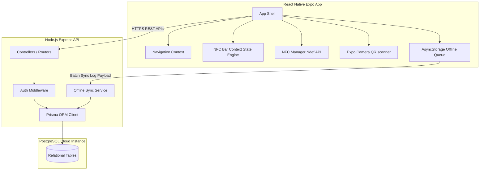
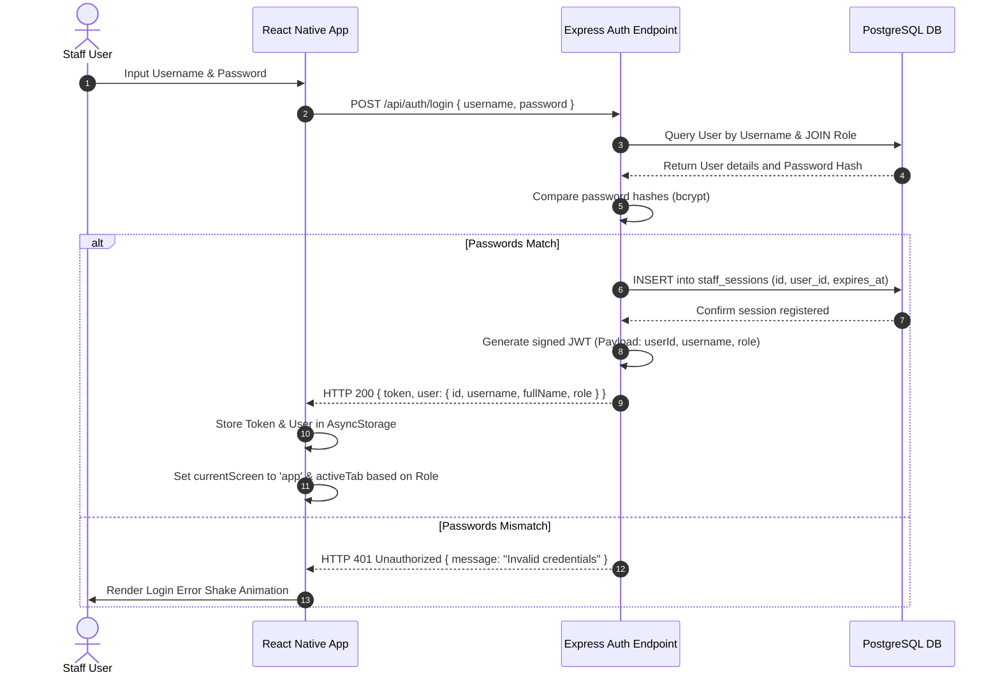
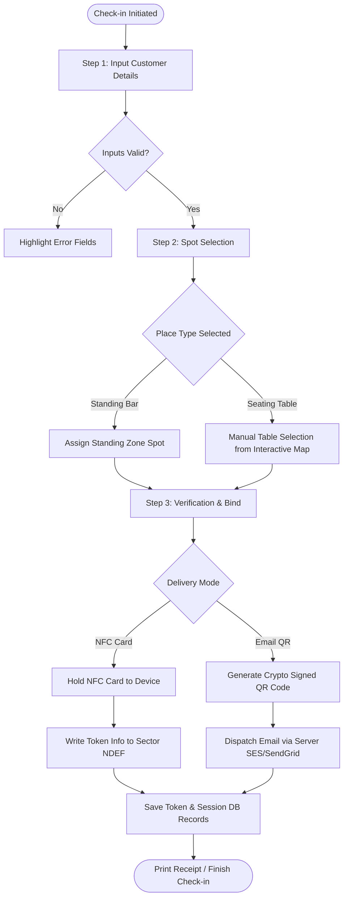
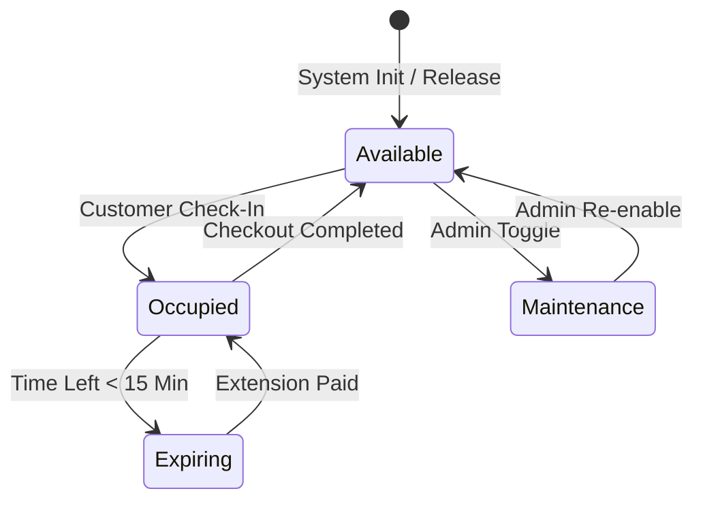
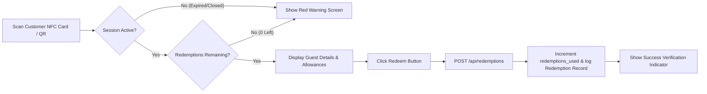
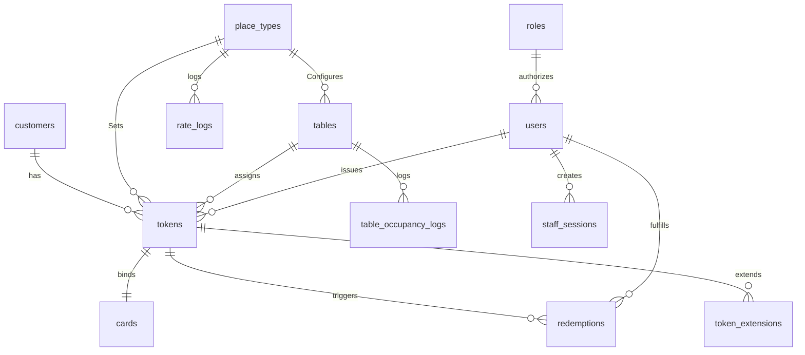
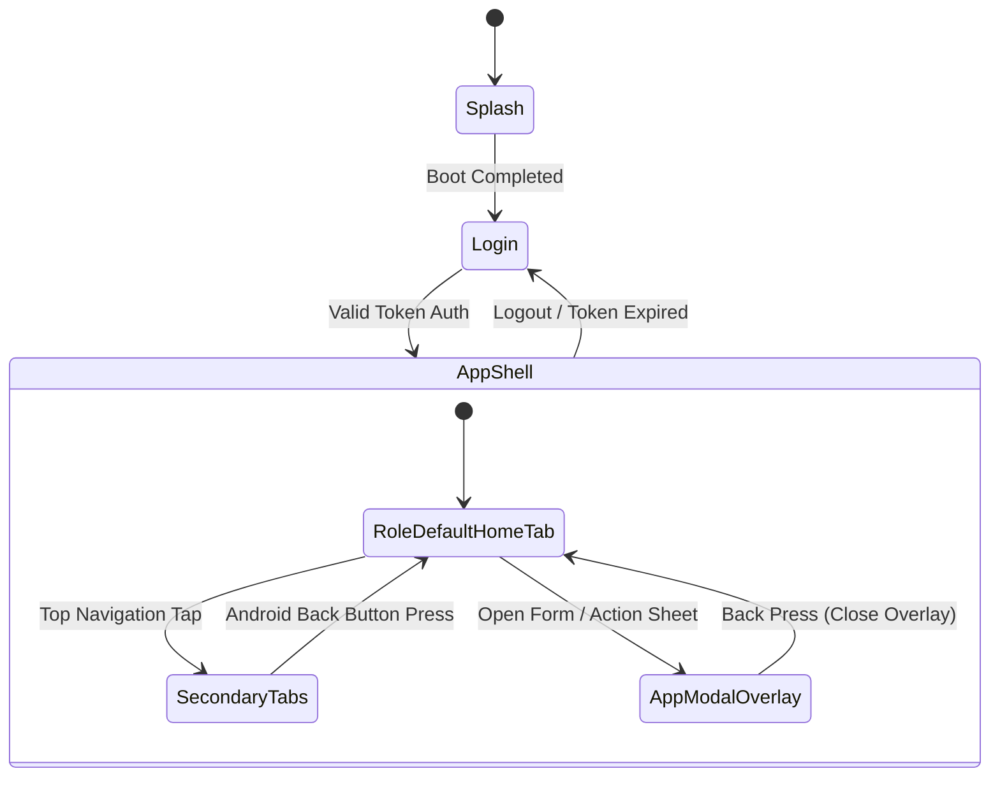
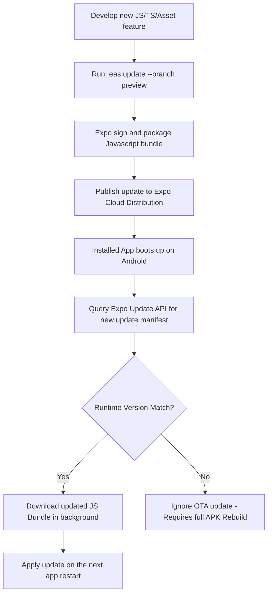

# End-to-End Technical & Functional Documentation
## NFC QR Bar Management System

This document serves as the primary technical and functional reference for developers, testers, project managers, and future maintainers of the NFC QR Bar Management System.

---

## 1. Project Overview

### Business Problem
Modern high-volume bars, clubs, lounges, and event spaces face operational bottlenecks at two main points: check-in (entry processing, age verification, table allocation) and drink redemptions/bartender processing. Cash, physical tickets, or legacy billing systems slow down service speed, introduce manual reconciliation errors, and prevent managers from obtaining real-time insights into bar occupancy and bartender performance.

### Objectives
- **Accelerate Guest Flow**: Streamline customer intake with automated check-in wizards (supporting both physical high-frequency NFC cards and digital QR code ticketing).
- **Secure Transaction Auditing**: Enforce cryptographically signed/verified session lifecycles for table occupancies and drink allowances.
- **Provide Live Operational Metrics**: Empower supervisors with real-time statistics on active patrons, seating maps, hourly revenue, and bartender productivity.
- **Enable Resilient Offline Capability**: Ensure the system handles local network instability smoothly by queuing operations locally on the React Native client and sync-logging them to a central server when connection is restored.

### Key Features
- **Role-Based Access Control (RBAC)**: Distinct interfaces for Admin, Receptionist, Bartender, and Manager.
- **Hybrid Delivery Modes**: Custom NFC card programming (Ndef sector writes) and signed Email QR code templates.
- **Dynamic Seating Management**: Interactive map showing seating vs standing status, capacity alerts, and manual overrides.
- **Session Lifespans & Extensions**: Multi-step extension checkout modals with live calculations.
- **Robust Hardware Controls**: Customized Android back-gesture priority stacks to prevent app exit during transactions.

### Technology Stack
- **Frontend Core**: React Native (Expo SDK 51), TypeScript, NativeWind / TailwindCSS style utilities, Expo Camera, React Context API.
- **Backend Core**: Node.js, Express, TypeScript, Prisma ORM, PostgreSQL database, JSON Web Tokens (JWT).
- **Tooling & CI/CD**: EAS CLI, expo-updates, Docker runtime.

### High-Level Architecture



---

## 2. Authentication Module

### Flow & Session Creation
The authentication module provides secure, role-restricted entry into the application. Upon successful credentials match, the server generates a signed JWT containing user identity and role mapping details, and registers a session in the `StaffSession` table.



### Role-Based Access Control (RBAC) Mapping
* **Admin**: Access to all panels, including raw database stats, table/staff/rate management configurations, deactivation overrides, and system logs.
* **Receptionist**: Dedicated check-in workflow wizard, customer queue, table selections, and card assignments.
* **Bartender**: Interactive orders grid, quick drink redemptions by scanning NFC cards, and drink status updates.
* **Manager**: Live seating map access, session extensions, manual table releases, and live metrics.

### Session Expiration & Logout
Sessions expire automatically according to the `expiresAt` column in the database (default: 12 hours). On logout, the client deletes the token from local storage, and makes an API call to delete the session record in the `StaffSession` table to prevent token reuse.

---

## 3. Dashboard Module

### Purpose
The Dashboard acts as the real-time operational command center. It aggregates key metrics from multiple relations (Sessions, Tables, Redemptions) to present an active state overview.

### Metrics Computed
* **Active Patrons**: Count of active `Token` records where status is `ACTIVE`.
* **Table Occupancy Rate**: `Occupied Tables / Total Active Tables` expressed as a percentage.
* **Remaining Allowances**: Average drink redemptions remaining across all active customer tokens.
* **Hourly Revenue Trend**: Rolling aggregation of `amountPaid` from active session creations and extensions.

### Live Updates & Permissions
The screen calls `fetchLatestState` inside the `NfcBarContext` to pull the latest snapshots. Only users with Roles `admin`, `manager`, or `receptionist` have access to the full dashboard dashboard layouts.

---

## 4. Check-In Module

The check-in module registers the customer, validates their profile, allocates a table/standing spot, collects payment, and binds the physical NFC card or digital QR code.



### Business Validation Rules
* **Capacity Safeguard**: The guest count input cannot exceed the selected table's seating capacity.
* **Unique Card Binding**: An NFC card cannot be assigned if its database status is already `'assigned'` or `'lost'`.
* **Active Check-In Check**: The backend rejects any check-in request if the phone number matches an already active session.

---

## 5. Table Management Module

### Seating States
Seating tables mapped in the system change state dynamically based on transaction events:

| Status | Color Representation | Description |
| :--- | :--- | :--- |
| **Available** | Emerald Green | The table is vacant, clean, and ready for check-in. |
| **Occupied** | Amber Yellow | Customers are actively seated. Session timer is ticking. |
| **Expiring** | Crimson Red | Active session has less than 15 minutes remaining. |
| **Maintenance** | Slate Gray | Table is temporarily locked out (e.g., cleaning, broken hardware). |



---

## 6. NFC Card Management

The system interfaces with physical Mifare Ultralight or NTAG Smart Cards using the mobile device's high-frequency transceiver.

```
NFC Card Sector Memory Map Layout:
┌──────────────────────────────┬──────────────────────────────┐
│ Sector Block Index           │ Content Stored               │
├──────────────────────────────┼──────────────────────────────┤
│ Block 0 (Metadata)           │ NDEF Signature String        │
│ Block 1 (Token identifier)   │ Secure UUID (Session ID)     │
│ Block 2 (Customer details)   │ Name, pax count, place type  │
│ Block 3 (Transaction checks) │ Write cycle count, expiry TS │
└──────────────────────────────┴──────────────────────────────┘
```

### Card Return & Sanitization Workflow
1. **Scanning**: The card is scanned at the checkout desk.
2. **Payment Auditing**: The system retrieves the current bill. If there is a pending payment, checkout is blocked.
3. **NDEF Wiping**: Once checkout completes, the device performs a secure NDEF overwrite, writing an empty state signature (`"NFC_BAR_EMPTY"`) onto the card.
4. **Status Release**: The card status in the PostgreSQL `cards` table resets to `'available'`, increasing its `writeCycles` counter.

---

## 7. QR Management

### Cryptographic Signatures
For customers choosing `EMAIL_QR` delivery mode, the system generates a signed QR code payload containing:
$$\text{Payload} = \{ \text{tokenNumber}, \text{customerId}, \text{endTimeStamp}, \text{signature} \}$$

The signature is generated on the server using HMAC-SHA256:
$$\text{Signature} = \text{HMAC-SHA256}(\text{tokenNumber} + \text{endTimeStamp}, \text{SERVER\_SECRET})$$

This design prevents customers from modifying their expiration timestamps or drink counts, as any changes will fail cryptographic signature verification checks.

---

## 8. Session Management

A session represents the contract between the venue and the customer.

### Session Lifecycle States
* `PENDING_PAYMENT`: Session details filled, waiting for payment confirmation before active use.
* `ACTIVE`: Session is running. Customer can redeem drinks.
* `EXTENDED`: Extra duration has been purchased and appended.
* `CLOSED`: Customer checked out, card returned, session closed.
* `CANCELLED`: Check-in aborted before card writing or payment finalized.

### Auto Timeout Logic
A background cron job runs on the server every 60 seconds:
1. Queries all `Token` rows where `status` is `ACTIVE` and `endTime` is less than `NOW()`.
2. Marks these tokens as `EXPIRED`.
3. Sets their corresponding tables to `AVAILABLE` (if not occupied by a subsequent session).

---

## 9. Payment Module

### Billing Calculation Formula
The total fee is calculated as:
$$\text{Total Fee} = (\text{Guest Count} \times \text{Base Rate}) + \text{Additional Extensions} + \text{Taxes}$$

Where the Base Rate is defined in `PlaceTypeConfig` for the selected zone.

### Transaction Confirmation Flow
1. **Billing Modal**: Displays a detailed breakdown of guest count, base rate, duration, and taxes.
2. **Mode Selector**: Support for Cash, Card, or UPI QR code.
3. **UPI Flow**: Dynamic generation of a UPI string containing merchant details and the exact transaction amount.
4. **Verification**: Once payment is marked as verified, the session status transitions to `ACTIVE`, and the table status updates to `OCCUPIED`.

---

## 10. Bartender Module

The Bartender Portal features a live grid displaying active patrons and drink redemptions.



---

## 11. Admin Module

The Admin Portal is restricted to users with administrative roles and contains the following subsections:

### Subsections
* **Staff Management**: Create, edit, and toggle active status for staff accounts.
* **Table Configurations**: Manage physical table mappings and capacities.
* **System Settings**: Global toggles to enable or disable specific features (e.g., NFC Card Mode vs. Email QR Mode).
* **Audit Logs & Reports**: View live logs of rate edits, session overrides, and system activity.

---

## 12. Notification Module

### Push Notifications & Alerts
- **Local Expiry Alerts**: Triggers a local background notification on the client app when a session is within 15 minutes of expiration.
- **Urgent Payment Reminders**: Alerts managers of sessions in the `PENDING_PAYMENT` state that require immediate attention.
- **Dynamic HUD Toasts**: In-app popups displaying toast messages for quick confirmation of actions.

---

## 13. API Documentation

| Endpoint | Method | Headers | Request Payload | Response (Success) | Error Codes |
| :--- | :--- | :--- | :--- | :--- | :--- |
| `/api/auth/login` | `POST` | None | `{ "username": "...", "password": "..." }` | `{ "token": "...", "user": {...} }` | `400 Bad Request`, `401 Unauthorized` |
| `/api/checkin` | `POST` | `Authorization: Bearer <JWT>` | `{ "customerName": "...", "phoneNumber": "...", "guestCount": 2, "placeTypeId": "..." }` | `{ "tokenNumber": "...", "endTime": "..." }` | `400 Validation Error`, `409 Active Session Exists` |
| `/api/tokens/:tokenNumber/extend` | `POST` | `Authorization: Bearer <JWT>` | `{ "extraMinutes": 60, "additionalAmount": 500 }` | `{ "newEndTime": "..." }` | `404 Token Not Found`, `400 Payment Verification Required` |
| `/api/redemptions` | `POST` | `Authorization: Bearer <JWT>` | `{ "tokenId": "...", "bartenderId": "..." }` | `{ "redemptionsUsed": 1, "remaining": 2 }` | `400 Limit Reached`, `403 Session Expired` |

---

## 14. Database Documentation



### Table Schemas

#### Customers Table (`customers`)
- `id` (UUID, PK)
- `phone_number` (VARCHAR, Unique)
- `name` (VARCHAR)
- `email` (VARCHAR, Nullable)
- `created_at` (TIMESTAMP)

#### Place Type Configuration Table (`place_types`)
- `id` (UUID, PK)
- `name` (VARCHAR, Unique)
- `rate_per_person` (DECIMAL(10,2))
- `base_time_minutes` (INTEGER)
- `redemptions_per_person` (INTEGER)
- `is_active` (BOOLEAN)

#### Tables Map Table (`tables`)
- `id` (UUID, PK)
- `table_number` (VARCHAR)
- `place_type_id` (UUID, FK -> `place_types.id`)
- `capacity` (INTEGER)
- `status` (VARCHAR)
- `current_token_id` (UUID, Nullable)

#### Tokens Table (`tokens`)
- `id` (UUID, PK)
- `token_number` (VARCHAR, Unique)
- `customer_id` (UUID, FK -> `customers.id`)
- `place_type_id` (UUID, FK -> `place_types.id`)
- `table_id` (UUID, FK -> `tables.id`, Nullable)
- `status` (VARCHAR)
- `start_time` (TIMESTAMP)
- `end_time` (TIMESTAMP)

---

## 15. Application State Management

The client state is managed through the centralized `NfcBarContext` state engine:

```
┌────────────────────────────────────────────────────────┐
│                   NfcBarProvider                       │
│                                                        │
│  State slices:                                         │
│  - currentScreen ('splash' | 'login' | 'app')          │
│  - activeTab ('checkin' | 'bartender' | 'tables')      │
│  - sessions / tables / cards datasets                  │
│                                                        │
│  Operations exposed:                                   │
│  - checkInGuest()                                      │
│  - closeGuestSession()                                 │
│  - fetchLatestState()                                  │
│  - setTab() / showToast()                              │
└────────────────────────────────────────────────────────┘
```

---

## 16. Navigation System

The navigation architecture is state-driven, using global context variables rather than standard stack library bindings to ensure strict screen flow control.



### Android Hardware Back Button Rules
1. **Critical Operation Protection**: Ignored during active NFC card programming (`isNfcWriting`), payment processing, or checkout database commits to prevent transaction corruption.
2. **Unsaved Form Protection**: Step 1 forms (Check-in details) and Admin form overlays (Add Table, Add Staff, Edit Rates) perform a dirty check. If modifications are present, prompts a confirmation Alert asking to discard or continue editing.
3. **Throttling Lock**: Ignores rapid multiple back presses within 350ms to ensure transitions and layout animations complete before processing the next event.
4. **Role-Aware Home Tab**: Navigates back to the default tab dynamically based on the authenticated user's role:
   - Receptionist/Admin: `'checkin'` tab
   - Bartender: `'bartender'` tab
   - Manager: `'tables'` tab
5. **Double-Back Exit**: Prompts the user with a `"Press back again to exit"` toast on the root screens. Exits only if pressed twice within 2000ms.

---

## 17. OTA Update Workflow

The system utilizes Expo updates to deliver over-the-air (OTA) javascript bundles to devices without requiring a full APK rebuild or manual reinstallation.



---

## 18. APK Build Workflow

EAS Build configurations manage native code compilation.

### Build Profiles (`eas.json`)
* **`development`**: Enables remote debugging and uses the Expo Go development client.
* **`preview`**: Compiles a standalone `.apk` package using the internal distribution model for direct QA testing.
* **`production`**: Produces a Play Store-compatible `.aab` package with strict release signatures.

---

## 19. Security

- **Authentication**: JWT signature validation using HS256. Passwords hashed using bcrypt.
- **Authorization**: Endpoint access verified via role IDs and permissions maps.
- **QR Security**: Cryptographically signed HMAC-SHA256 signatures prevent tampering.
- **NFC Security**: Customized memory maps prevent unauthorized reading.
- **API Security**: CORS restrictions, SQL injection protection via Prisma parameter queries, and API rate limiting.

---

## 20. Error Handling

### Offline Recovery & Resilience
1. **Network Interceptor**: Intercepts failed API calls. If the error is network-related, the app caches the payload locally in AsyncStorage.
2. **Local Queue**: Adds the failed operation to the local pending sync queue.
3. **Connection Listener**: Monitored via netinfo. When connection is restored, a background service processes the queue.
4. **Conflict Resolution**: The backend validates timestamps. If a conflict occurs, the system logs the conflict details in the `SyncLog` table for admin review.

---

## 21. Testing Strategy

- **Unit Testing**: Isolated logic validation using Jest.
- **Integration Testing**: API endpoint testing with SuperTest and a clean database.
- **Manual Verification**: End-to-end flow checks using physical NFC cards and printed test QR codes.
- **Edge Cases**:
  - Scanning an empty or unassigned card (must trigger an invalid card error).
  - Attempting to check in a phone number that is already active (must block check-in).

---

## 22. Deployment Guide

### Backend Deployment
Deploy the backend using a Docker runtime:
```bash
docker build -t nfc-bar-backend .
docker run -d -p 3000:3000 --env-file .env nfc-bar-backend
```

### Frontend OTA Release
Publish code changes over-the-air:
```bash
cd frontend
eas update --branch preview --message "Release message details"
```

---

## 23. Maintenance Guide

### Publishing OTA Updates
Ensure the `runtimeVersion` configuration matches before publishing updates. Publish using the EAS updates command.

### Rebuilding APK
Run the build command to generate a new standalone APK:
```bash
eas build --platform android --profile preview
```

---

## 24. Troubleshooting Guide

### Issue: NFC Write Operation Failures
- **Possible Cause**: The card was removed from the device's sensor area before writing finished.
- **Resolution**: Prompt the user to hold the card flat against the back of the device until the success animation is displayed.

### Issue: Table Lock Conflicts
- **Possible Cause**: A session ended abruptly without clearing the table's state.
- **Resolution**: Use the Admin Portal Override tool to manually force release the locked table.

---

## 25. Appendix

### Folder Structure
```
├── backend/
│   ├── prisma/             # Schema definitions
│   ├── src/
│   │   ├── controllers/    # Route handlers
│   │   ├── middleware/     # Auth and validation middleware
│   │   └── index.ts        # Server entry point
├── frontend/
│   ├── src/
│   │   ├── app/            # MainAppShell entry point
│   │   ├── components/     # UI components
│   │   ├── context/        # NfcBarContext state engine
│   │   └── features/       # Feature-specific screens
│   ├── app.json            # Expo configuration
│   └── eas.json            # EAS build profiles
```

### Build & Release Commands
- **Type Check**: `npx tsc --noEmit`
- **OTA Update**: `eas update --branch preview`
- **Build APK**: `eas build --platform android --profile preview`
