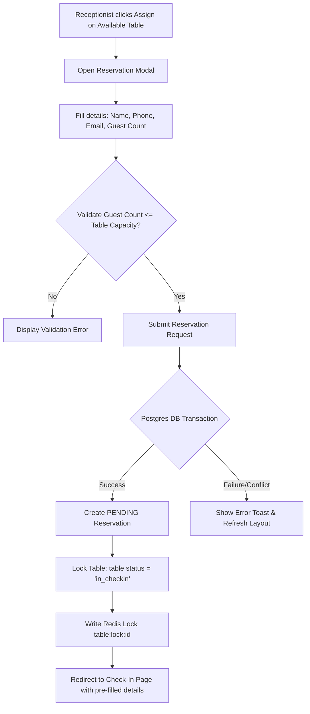
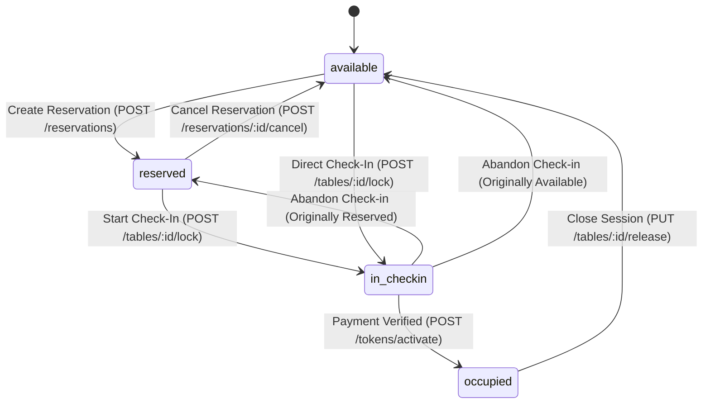
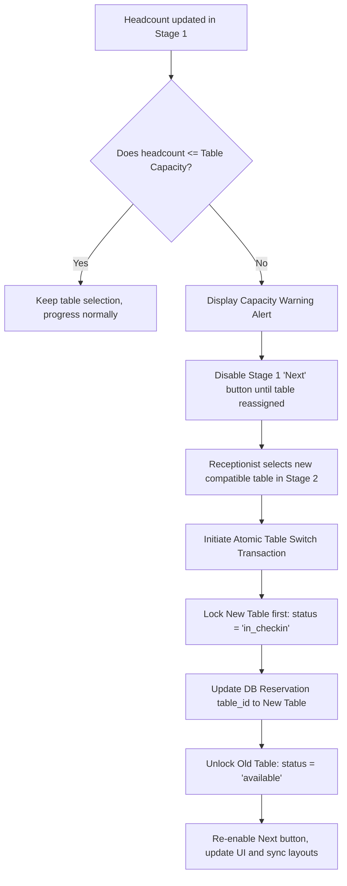
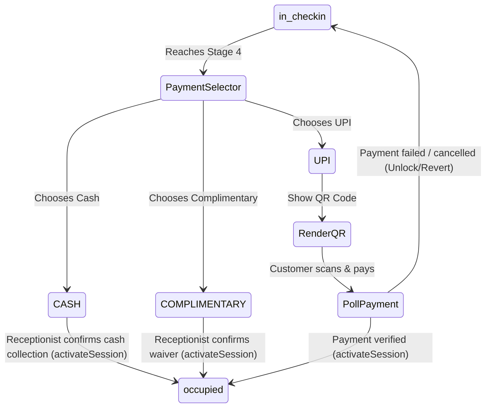
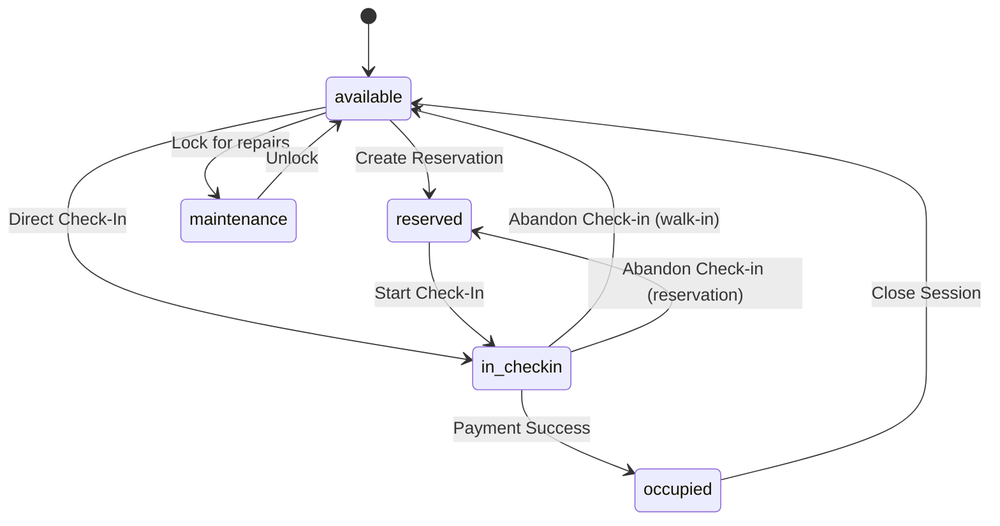
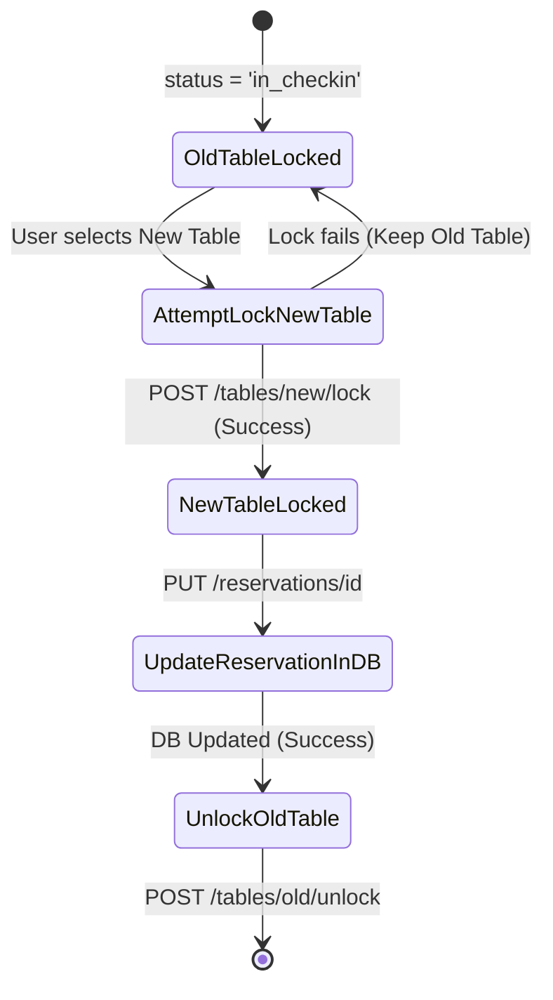

# Table Reservation, Assignment & Check-In Lock Specification
**Version:** 1.0.0  
**Status:** Approved Specification  
**Scope:** Web Frontend, Backend API & Database

---

## 1. Core Table States

The system defines five primary operational states for table resources. Every table must reside in exactly one of these states at all times:

| State | Definition | Transition Initiators | Allowed Actions | Blocked Actions |
| :--- | :--- | :--- | :--- | :--- |
| **`available`** | The table is vacant, clean, and open for walk-ins or reservations. | - Session closed (Occupied → Available)<br>- Check-in abandoned (In Check-in → Available)<br>- Reservation cancelled (Reserved → Available)<br>- Maintenance ends (Maintenance → Available) | - Reserve (create reservation)<br>- Assign (create reservation + redirect to Check-in)<br>- Check-In (immediate check-in)<br>- Lock for Maintenance | - Extend Session<br>- Close Session<br>- Release Lock (already unlocked) |
| **`reserved`** | The table has an active, pending customer reservation. | - Reservation created (Available → Reserved)<br>- Check-in abandoned (In Check-in → Reserved) | - Check-In (by reservation owner)<br>- Cancel Reservation (by owner/admin)<br>- Reassign Table (capacity change) | - Reserve again<br>- Assign to new walk-in<br>- Extend Session<br>- Close Session |
| **`in_checkin`** | The table is locked by a receptionist who is actively conducting the check-in wizard. | - Receptionist starts Check-in (Available/Reserved → In Check-in) | - Abandon Check-in (revert)<br>- Select alternative table (switch)<br>- Submit details / QR Scan<br>- Confirm Payment | - Reserve<br>- Assign<br>- Cancel Reservation<br>- Extend Session<br>- Close Session<br>- Maintenance Lock |
| **`occupied`** | The table is actively seated with guests who have a verified session token. | - Payment confirmed (In Check-in → Occupied) | - Extend Session (+20m, +25m, +30m)<br>- Close Session (Vacate table)<br>- Inspect session details | - Check-In<br>- Reserve<br>- Assign<br>- Cancel Reservation<br>- Lock for Maintenance |
| **`maintenance`** | The table is out of service (cleaning, repairs, configuration). | - Administrator lock (Available → Maintenance) | - Unlock to Available (admin only)<br>- Inspect details | - Reserve<br>- Assign<br>- Check-In<br>- Extend Session<br>- Close Session |

---

## 2. Assign Workflow

The **Assign** button acts as a fast-track shortcut that bridges the floor plan layout with the check-in wizard while strictly enforcing a **reservation-first** lifecycle.



### Business Rules for Assigning:
1. **Bypass Prohibition**: Clicking "Assign" must never route the receptionist directly to the Check-In page. It must open the Reservation modal.
2. **PostgreSQL Sync**: A `PENDING` reservation record must be persisted in the database before navigation.
3. **Database Relationships**: The newly created `Reservation` must map to the selected `Table.id` with `status: 'PENDING'`.
4. **Immediate Check-In Lock**: If reservation creation succeeds:
   * The client must automatically call the lock API (`POST /tables/:id/lock`).
   * The table status in PostgreSQL must update to `in_checkin`.
   * The client must redirect to `/check-in` pre-loaded with customer details, table selection, and the new `reservationId`.
5. **Simultaneous Selection Conflict**: If Receptionist A attempts to assign/reserve Table S-02 while Receptionist B is already in the process of assigning it:
   * The database unique constraint or Redis lock must reject the second transaction.
   * Receptionist B must receive a validation message: `"Table S-02 has already been reserved or locked by another session."`

---

## 3. Reservation Lifecycle

The state chart below details the valid pathways, transitions, and rollbacks for tables under reservation control:



### Valid Rollback Paths
* **`reserved` → `available`**: Occurs if the customer cancels their reservation or the system auto-expires it due to a no-show.
* **`in_checkin` → `reserved`**: Occurs if a check-in that originated from a reservation is abandoned, fails payment, or is closed early. The table must revert to `reserved` to preserve the original reservation.
* **`in_checkin` → `available`**: Occurs if a check-in that started from a vacant walk-in is abandoned. The table must return to `available`.

---

## 4. Reservation + Customer Detail Updates

If a receptionist edits customer details or guest counts during the check-in wizard, these updates must remain fully synchronized with the database to maintain audit trail consistency.

### Required Database Updates:
1. **Stage 1 Modifications**: If details (Name, Phone, Email, Guest Count) are edited:
   * **Reservation Present**: Call `PUT /reservations/:id` to update the name, phone, email, and guest count on the `Reservation` record in PostgreSQL.
   * **Pending Token Present**: Call `POST /check-in/pending` to update customer details on the `Customer` and `Token` tables.
2. **Synchronization Window**: The frontend state must trigger these updates immediately during the step transitions (e.g., clicking "Next" in Stage 1/2) to prevent local storage cache from drifting from the authoritative DB.

---

## 5. Capacity Change Workflow

If a guest's count changes during check-in, the system must evaluate whether the current table can accommodate them, and if not, handle table reassignment atomically.



### Destination Table State Rules:
* **`destination table unavailable`**: Reassignment fails immediately; old table remains locked.
* **`destination table occupied`**: Blocked; cannot select.
* **`destination table reserved`**: Only selectable if the reservation belongs to the same customer/session.
* **`destination table in_checkin`**: Blocked; locked by another receptionist.
* **`destination capacity insufficient`**: Blocked; validation error displays.
* **`destination table becomes unavailable during click`**: The lock request `POST /tables/:id/lock` will fail. The frontend catches the error, displays an alert, and keeps the old table locked.
* **`check-in abandonment after reassignment`**: If check-in is abandoned *after* reassigning to a new table, the rollback must release the *new* table to `available` (or `reserved` if it inherited a reservation) and the old table must remain `available`.

---

## 6. Check-In Lock Workflow

The `in_checkin` status is an authoritative database-level lock that guards the seating layouts throughout the check-in process.

```
Check-In Wizard Stages:
[Stage 1: Customer Details] ──► [Stage 2: Table Seating] ──► [Stage 3: QR Code Verification] ──► [Stage 4: Payment Selector] ──► [Stage 5: Seated]
└──────────────────────────────────── ACTIVE Lock (in_checkin) ────────────────────────────────────┘
```

1. **Lock Duration**: The table status remains `in_checkin` continuously from Stage 2 through the final payment validation in Stage 4.
2. **Intermediate Protection**: Action steps (e.g., clicking "Verify QR", generating the email, or toggling between Cash and UPI payment modes) must **never** toggle the table status back to `available` or `reserved`.
3. **Double Selection Block**: Any concurrent queries to the tables API from other receptionist dashboards must return this table with `status: 'in_checkin'`, blocking any click handlers.

---

## 7. Original Table State Preservation

When a receptionist locks a table for check-in, the system must remember what its status was prior to locking so that rollback functions can restore it correctly on failure.

1. **Storage of State**:
   * **Database Layer**: The Redis lock key metadata `table:lock:${tableId}` must contain the `originalStatus` string (`"available"` or `"reserved"`).
   * **Client Layer**: The string must be stored in the frontend context and cached in `localStorage` under `bar_checkin_original_status` to survive browser refreshes.
2. **Restoration Logic**:
   * If check-in is aborted or cancelled:
     * The client calls `POST /tables/:id/unlock`.
     * The backend retrieves the `originalStatus` from the Redis lock.
     * If the lock is missing or expired, the backend falls back to checking PostgreSQL: if a `PENDING` reservation exists for this table, it reverts to `reserved`; otherwise, it reverts to `available`.

---

## 8. Table Switching During Check-In

Table switching must be executed as an atomic sequence of API operations to prevent race conditions:

```
[Start Switch] 
   └──► 1. POST /tables/new-id/lock (Acquire lock on new table)
             ├── SUCCESS ──► 2. PUT /reservations/id (Update reservation table_id in DB)
             │                    └──► 3. POST /tables/old-id/unlock (Release lock on old table)
             │                              └──► [Complete Switch]
             └── FAILURE ──► [Abort Reassignment] (Keep lock on old table, show error toast)
```

1. **Old Table Protection**: If locking the new table fails, the old table's status must remain untouched (`in_checkin`) and the receptionist must not lose their session draft.
2. **Redis Lock Cleanup**: When the old table is unlocked, its corresponding Redis key `table:lock:${oldId}` must be deleted immediately.
3. **UI Synchronization**: A background refresh must trigger on the client to update the floor layout instantly.

---

## 9. Concurrency

The backend must resolve concurrent conflicts using strict transactional isolation and database locks:

* **PostgreSQL Row Locking**: Any operation modifying table statuses or reservation links must run inside a transaction block with explicit row locking (`SELECT ... FOR UPDATE` or Prisma `$transaction` API).
* **Redis Lock Expirations**: Redis keys for table locks (`table:lock:${tableId}`) must have a strict Time-to-Live (TTL) of **3600 seconds** (1 hour). This prevents orphaned table locks if a receptionist's computer crashes or loses network connectivity.
* **Race Condition Resolutions**:
  * *Two receptionists assign the same table*: The first request creates the reservation and locks the row. The second request fails with `409 Conflict` (table already locked/reserved).
  * *Cancelling a reservation while check-in starts*: If receptionist A attempts to cancel a reservation while receptionist B is locking it for check-in:
    * The lock API (`POST /tables/:id/lock`) checks if status is `reserved`. If the cancellation completes first, status is `available` (not `reserved`), and the lock succeeds as a walk-in, or if the lock completes first, the cancellation request fails because the status is `in_checkin` (cancellations are blocked in this state).

---

## 10. Multi-Receptionist Live Synchronization

Receptionists must work with real-time (or near real-time) information to prevent duplicate attempts:

1. **State Polling**: The frontend context must poll `refreshTokens()`, `refreshTables()`, and `refreshReservations()` concurrently.
2. **Synchronization Interval**: Polling must occur at a strict interval of **10 seconds**.
3. **Maximum Stale Period**: Receptionists must not view stale table data for more than 10 seconds.
4. **Action Triggers**: Any successful mutations (Reserving, Assigning, Locking, Activating, Closing, Cancelling) must immediately call `refreshAll()` locally, bypassing the interval timer.

---

## 11. Payment Gate

Payment verification is the final gateway that transitions the table from `in_checkin` to `occupied` status.



* **Failure Recovery**: If a digital payment fails or is cancelled, the table must remain in `in_checkin` status. The receptionist can choose a different payment method or safely abandon the check-in to trigger rollbacks.
* **Duplicate Submissions**: The activation button must be disabled immediately upon click, displaying a loading spinner. The backend route must execute inside a Prisma transaction to prevent duplicate session activations.

---

## 12. Rollback Matrix

The following matrix defines the outcomes for major system operations:

| Current State | Action | Success State | Failure State | Rollback Action |
| :--- | :--- | :--- | :--- | :--- |
| **`available`** | Reserve Table | `reserved` | `available` | Delete reservation record; table reverts to `available`. |
| **`available`** | Assign Table | `in_checkin` | `available` | Delete reservation record; release Redis lock; table reverts to `available`. |
| **`reserved`** | Start Check-In | `in_checkin` | `reserved` | Release Redis lock; table reverts to `reserved` (reservation status stays `PENDING`). |
| **`in_checkin`** | Switch Table | `in_checkin` (new table) | `in_checkin` (old table) | Keep lock on old table; release new table lock (if acquired); show error toast. |
| **`in_checkin`** | Abandon Check-In | `available` or `reserved` | `in_checkin` | Revert table status to its `originalTableStatus` stored in cache/Redis lock. |
| **`in_checkin`** | Confirm Payment | `occupied` | `in_checkin` | Table remains `in_checkin`. Receptionist can retry payment or abandon check-in. |
| **`occupied`** | Close Session | `available` | `occupied` | Keep table status as `occupied`; session remains active; log the database error. |

---

## 13. QR / Token Lifecycle

The session token and its authorized QR code must progress through distinct, non-overlapping statuses:

1. **`PENDING_PAYMENT`**: Customer details are recorded, and the QR code is generated. The token is locked to the table.
2. **`ACTIVE`**: Payment is verified. The session timer begins. The QR code is active for drink redemptions.
3. **`EXTENDED`**: Additional duration is purchased. The `endTime` is pushed forward in PostgreSQL.
4. **`EXPIRED`**: The session duration has run out. The token is marked expired, but remains occupied until vacated.
5. **`CANCELLED` / `CLOSED`**: The customer has vacated the table. The token status is updated, and the QR code is **permanently invalidated**.
6. **QR Invalidation on Transfer**: If a table session is transferred to another table, the old token number is deleted, and a new token number/QR code is generated. The old QR code is marked as `CLOSED` and can never be scanned for drink redemptions.

---

## 14. Browser Refresh / Back / Close Scenarios

To prevent local storage drafts from corrupting active assignments:

* **Page Refresh**: The frontend must retrieve the `bar_incomplete_checkin` draft. If the draft contains a valid, active `tableId`, the page must check if the table status in the database is still `in_checkin`. If yes, it loads the draft stage.
* **Draft Overwrite Protection**: If a receptionist clicks **Assign** on a table, the system writes `bar_checkin_assign_target` to `localStorage`. On mounting `/check-in`:
  * If a draft `bar_incomplete_checkin` exists, the page shows the "Incomplete Check-In Found" prompt.
  * If the user selects **No** (discard draft), the system **clears the draft** and loads the new target assignment from `bar_checkin_assign_target`.
  * If they select **Yes** (resume draft), the system **unlocks the new target table** (reverting its status) and resumes the old draft.
* **Tab Closure**: If the browser tab is closed, the database table remains locked as `in_checkin`. When the receptionist logs back in, they are prompted to resume the check-in (re-acquiring the lock) or abandon it (unlocking the table).

---

## 15. API Contract Expectations

### A. Lock Table
* **Endpoint**: `POST /api/tables/:id/lock`
* **Request Body**: None (inferred from JWT authenticated user)
* **Validations**:
  * Table `id` must be a valid UUID.
  * Table status must be `available` or `reserved`.
* **Database Updates**: Table status set to `in_checkin`.
* **Redis Updates**: Set `table:lock:${id}` with TTL of 3600s.
* **Success Response**: `{ success: true, table: Table }` (Status `200`)
* **Error Response**: `{ success: false, error: { message: "Table cannot be locked..." } }` (Status `400`)

### B. Unlock Table
* **Endpoint**: `POST /api/tables/:id/unlock`
* **Request Body**: `{"forceAvailable": boolean}` (optional)
* **Validations**: Table status must be `in_checkin`.
* **Database Updates**: Reverts table status to `reserved` (if pending reservation exists) or `available`.
* **Redis Updates**: Deletes `table:lock:${id}` key.
* **Success Response**: `{ success: true, table: Table }` (Status `200`)

### C. Update Reservation (Table Switch)
* **Endpoint**: `PUT /api/reservations/:id`
* **Request Body**: `{"tableId": "new-uuid"}`
* **Validations**:
  * New table must be `available` or `in_checkin`.
  * Receptionist must own the reservation (or be admin/manager).
* **Database Updates (Transaction)**:
  * Updates `tableId` on `Reservation` record.
  * Updates old table status to `available`.
  * Updates new table status to `in_checkin`.
* **Redis Updates**:
  * Deletes lock for old table.
  * Creates lock for new table with `originalStatus = 'reserved'`.
* **Success Response**: `{ success: true, reservation: Reservation }` (Status `200`)

---

## 16. Database Consistency Rules

To prevent database corruption, the following integrity constraints must be maintained:

1. **Table Seating Mutex**: A table cannot map to more than one active token (`Token.status = 'ACTIVE' | 'EXTENDED'`).
2. **Lock-Status Sync**: A table status cannot be `in_checkin` unless a corresponding Redis key `table:lock:${id}` exists (or was created by the active receptionist).
3. **No Orphaned Reservations**: If a reservation status is `ASSIGNED`, the associated table's status must be `occupied` or `available` (if they have checked out). It must never remain `reserved`.
4. **Active Token Check**: A token cannot remain `ACTIVE` if the table status has reverted to `available` or `maintenance`.

---

## 17. UI State / Button Rules

Depending on the table status, the action buttons in the seating layout and inspect drawers must update dynamically:

| Table Status | Assign Button | Reserve Button | Check-In Button | Cancel Button | Change Table | Close Session | Extend |
| :--- | :--- | :--- | :--- | :--- | :--- | :--- | :--- |
| **`available`** | Enabled | Enabled | Enabled | Hidden | Hidden | Hidden | Hidden |
| **`reserved`** | Disabled | Disabled | Enabled (Owner) | Enabled (Owner)| Hidden | Hidden | Hidden |
| **`in_checkin`**| Disabled | Disabled | Disabled | Hidden | Enabled | Hidden | Hidden |
| **`occupied`** | Disabled | Disabled | Disabled | Hidden | Hidden | Enabled | Enabled |
| **`maintenance`**| Disabled | Disabled | Disabled | Hidden | Hidden | Hidden | Hidden |

---

## 18. Complete End-to-End Scenarios

### Scenario A: Normal Reservation → Check-In
1. Guest calls; receptionist reserves Table S-02. Table status becomes `reserved`.
2. Guest arrives; receptionist clicks **Check-In** on S-02.
3. Table status becomes `in_checkin`. Detail fields are pre-filled.
4. Receptionist completes verification and UPI payment.
5. Table status becomes `occupied`. Session token starts.

### Scenario B: Capacity Increase Requiring Table Reassignment
1. Guest reserves Table S-12 (capacity: 4) for 4 members. Table is `reserved`.
2. Guest arrives with 6 members. Receptionist edits guest count to 6 in Stage 1.
3. System shows warning: `"Guest count exceeds table capacity."` Next button is disabled.
4. In Stage 2, receptionist selects Table L-01 (Premium Zone, capacity: 6).
5. Frontend locks L-01, updates the database reservation record, and unlocks S-12.
6. Check-in proceeds on L-01. Upon payment, L-01 becomes `occupied`, and S-12 reverts to `available`.

### Scenario C: Two Receptionists Compete for Same Table
1. Table S-05 is `available`. Receptionist A clicks **Assign** and opens the reservation modal.
2. Receptionist B simultaneously clicks **Assign** on S-05.
3. Receptionist A submits the reservation first. Table S-05 is locked to `in_checkin`.
4. Receptionist B submits their reservation. The API rejects the request with `400 Lock Error: Table is already locked for check-in`. The frontend shows an alert, closes the modal, and refreshes the floor layout.

---

## 19. State Transition Diagrams

### Table State Transitions


### Table Switching Lifecycle (Atomic)


---

## 20. Final Business Rules

1. **Database Authority**: The PostgreSQL database remains the single, final authority on table and reservation states. Local storage and memory states must only be used to recover active sessions.
2. **Lock Mutex**: A table cannot be locked (`in_checkin`) by more than one user at a time.
3. **No Direct Check-Ins on Reserved Tables**: Checking in a reserved table must always consume its associated reservation and transition it to `ASSIGNED`.
4. **Atomic Reassignment**: Table reassignment must lock the new table *before* releasing the old table.
5. **Ownership Enforcement**: Receptionists can only check in, modify, or cancel reservations they own, unless they hold an Administrator or Manager role.
6. **No Stale Reversals**: Abandoning a check-in must revert the table to its *original* pre-lock status, never default to `available` if it was previously reserved.
7. **Complete QR Invalidation**: Once a session token is vacated or transferred, its associated QR code/token number must be permanently deactivated in the database.
