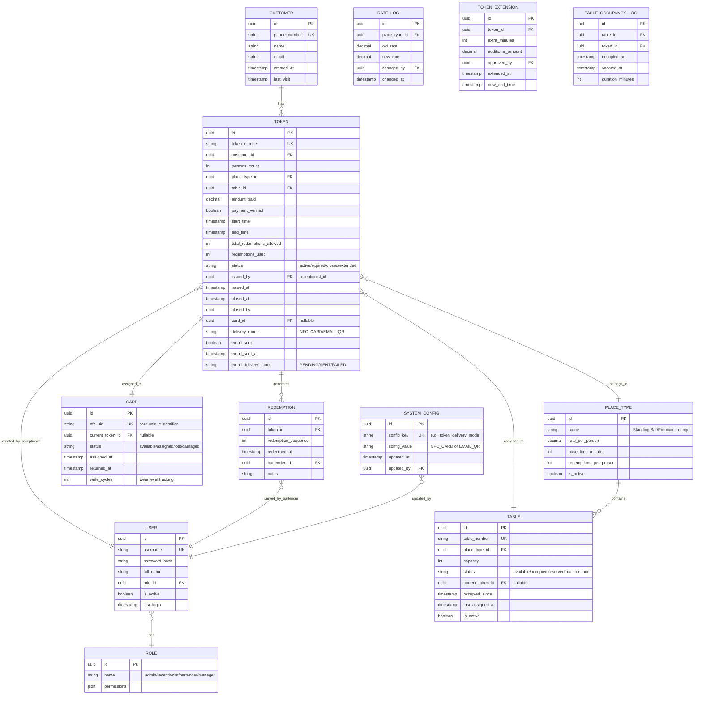
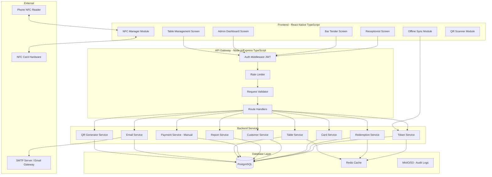
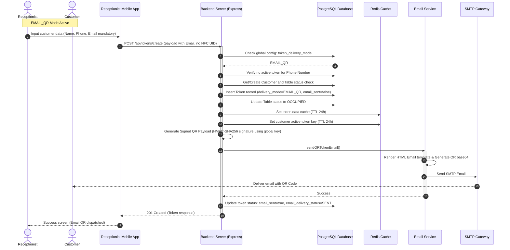
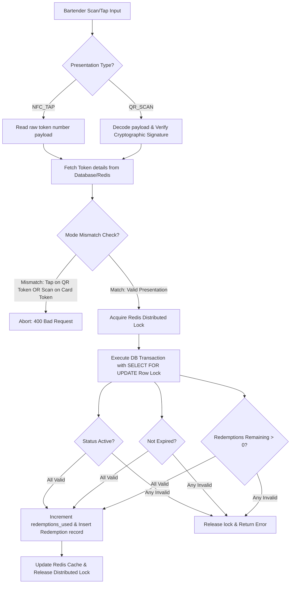

# NFC Bar Management System - Complete BRD & Technical Architecture (TypeScript)

## 1. Business Requirements Document (BRD)

### 1.1 Project Overview
**Project Name:** NFC Tap & Token - Bar Management System

**Objective:** Digitize customer entry, payment, and redemption process using either NFC cards or Email QR codes (configurable system-wide), eliminating paper tokens and manual tracking. Includes table assignment and occupancy tracking for different place types.

### 1.2 Stakeholders
| Stakeholder | Role |
|-------------|------|
| Receptionist | Onboards customers, collects payment, configures/verifies delivery mode, issues NFC cards (NFC mode) or triggers Email QR codes (Email QR mode), assigns tables |
| Bar Tender | Serves drinks, processes redemptions via NFC taps (NFC mode) or QR scans (Email QR mode) |
| Customer | Receives NFC card or Email QR code, presents it for service, assigned to table |
| Admin | Manages rates, views reports, configures global token delivery mode, monitors card inventory, manages table layout |
| Management | Analyzes sales, redemption patterns, peak hours, table occupancy |

### 1.3 Functional Requirements

#### FR1: Customer Check-in & Card/Token Issuance (Receptionist Module)
| ID | Requirement |
|----|-------------|
| FR1.1 | Capture customer phone number (mandatory, unique per session) |
| FR1.2 | Capture customer name (mandatory) |
| FR1.3 | Capture email ID (optional in NFC_CARD mode, mandatory in EMAIL_QR mode) |
| FR1.4 | Capture number of persons (1-20, integer) |
| FR1.5 | Select place type: Standing Bar / Premium Lounge |
| FR1.6 | **Select available table number for the selected place type** |
| FR1.7 | Auto-calculate amount based on `persons × rate(place_type)` |
| FR1.8 | Display calculated amount to receptionist |
| FR1.9 | Manual payment verification button (after cash/card received) |
| FR1.10 | Generate unique alphanumeric token number (format: `BAR-YYYYMMDD-XXXXX`) |
| FR1.11 | Write token number to blank NFC card (NTAG213 compatible) (NFC_CARD mode only) |
| FR1.12 | Associate token with start time, end time, redemption limit, table_id, and delivery_mode |
| FR1.13 | Mark table as occupied after successful token creation |
| FR1.14 | Handover card (NFC_CARD mode only) or trigger automated Email QR dispatch (EMAIL_QR mode only) |
| FR1.15 | Admin can configure Token Delivery Mode (NFC_CARD / EMAIL_QR) |
| FR1.16 | Configuration is applied globally via System Configuration |
| FR1.17 | System hides NFC-specific functions when Email QR mode is active |
| FR1.18 | System hides Email-specific functions when NFC Card mode is active |

#### FR2: Redemption Processing (Bar Tender Module)
| ID | Requirement |
|----|-------------|
| FR2.1 | Bar tender taps customer's NFC card (NFC mode) or scans customer's Email QR (Email QR mode) |
| FR2.2 | App reads token number from card (NFC) or decodes and verifies token signature from QR code (QR) |
| FR2.3 | Fetch token details from backend / Redis cache |
| FR2.4 | Validate: token exists, status is active, not expired, redemptions remaining > 0 |
| FR2.5 | Increment redemption count by 1 |
| FR2.6 | Record redemption timestamp and bartender ID |
| FR2.7 | Display success message with remaining redemptions |
| FR2.8 | Allow bar tender to serve drinks |

#### FR3: Time Extension (Receptionist/Management Module)
| ID | Requirement |
|----|-------------|
| FR3.1 | Customer requests time extension |
| FR3.2 | Receptionist taps customer card (NFC mode) or inputs/scans token number (Email QR mode) |
| FR3.3 | Display current token details (time left, redemptions used, table number) |
| FR3.4 | Calculate extension amount based on additional persons/time |
| FR3.5 | Mark payment collected (manual) |
| FR3.6 | Update token end time (extend by selected duration) |
| FR3.7 | No change to token number or existing redemption count |
| FR3.8 | Card/QR continues to work without rewriting or generating new QR code |

#### FR4: Card Return & Closure
| ID | Requirement |
|----|-------------|
| FR4.1 | Customer returns card at exit (NFC_CARD mode) or receptionist initiates checkout (Email QR mode) |
| FR4.2 | Receptionist closes session via NFC card tap (NFC_CARD) OR by scanning the customer's Email QR code or searching phone number/name on the dashboard (EMAIL_QR) |
| FR4.3 | Mark token status as "closed" |
| FR4.4 | Mark table as available again |
| FR4.5 | Calculate total redemptions vs limit, time used vs allocated |
| FR4.6 | Display session summary |
| FR4.7 | Option to erase card data (or mark as reusable) (NFC_CARD mode only) |
| FR4.8 | Card added back to available inventory (NFC_CARD mode only) |

#### FR5: Table Management (Admin/Receptionist)
| ID | Requirement |
|----|-------------|
| FR5.1 | Define tables per place type (Standing Bar: numbered standing areas, Premium Lounge: numbered tables) |
| FR5.2 | Track occupancy status per table (available/occupied/reserved/maintenance) |
| FR5.3 | Display only available tables when issuing new token |
| FR5.4 | Show current occupancy of each table in real-time |
| FR5.5 | Admin can add/edit/remove tables |
| FR5.6 | Generate table occupancy report by hour/day |
| FR5.7 | Prevent assigning occupied table to new customer |

#### FR6: Reporting & Admin
| ID | Requirement |
|----|-------------|
| FR6.1 | Daily sales report (total collections, redemptions served) |
| FR6.2 | Peak hour analysis (redemption frequency by hour) |
| FR6.3 | Card inventory tracking (active, assigned, lost) (NFC_CARD mode) |
| FR6.4 | Rate card management (CRUD for place types and rates) |
| FR6.5 | User management (receptionists, bartenders with roles) |
| FR6.6 | Table utilization report (average occupancy, turnover rate) |
| FR6.7 | Email delivery status report (active, pending, sent, failed) (EMAIL_QR mode) |

#### FR7: Email QR Issuance (EMAIL_QR Mode)
| ID | Requirement |
|----|-------------|
| FR7.1 | Email becomes mandatory in Email QR Mode |
| FR7.2 | Generate unique token number |
| FR7.3 | Generate secure QR Code containing signed token payload (HMAC/JWT) using global application key |
| FR7.4 | Generate HTML Email using templates |
| FR7.5 | Embed secure QR code inside email as Base64 image |
| FR7.6 | Send email automatically upon check-in completion |
| FR7.7 | Store email delivery status (PENDING / SENT / FAILED) and send timestamp |
| FR7.8 | Allow receptionist to manually trigger email resend from dashboard |
| FR7.9 | Customer presents QR code to bartender instead of NFC card |

#### FR8: QR Redemption (EMAIL_QR Mode)
| ID | Requirement |
|----|-------------|
| FR8.1 | Receptionist/Bartender scans customer QR code via device camera |
| FR8.2 | Decode signed token payload from QR code |
| FR8.3 | Verify cryptographic signature of the QR code using global application secret key |
| FR8.4 | Validate active status of the decoded token |
| FR8.5 | Validate token expiry time |
| FR8.6 | Validate remaining redemptions |
| FR8.7 | Deduct redemption (increment redemptions_used) |
| FR8.8 | Display remaining redemptions to bartender |

### 1.4 Non-Functional Requirements

| NFR | Requirement |
|-----|-------------|
| NFR1 | NFC read/write latency < 500ms / QR code scan decoding and verification latency < 300ms |
| NFR2 | App works offline for up to 30 minutes (NFC offline buffer sync / QR signatures require online lookup or locally cached keys) |
| NFR3 | Concurrent tap/scan support (multiple bartenders, no double redemption using Redis distributed locks) |
| NFR4 | Token number format ensures uniqueness |
| NFR5 | 99.9% uptime for backend and email dispatch service |
| NFR6 | Data retention: 7 years for transactions |
| NFR7 | PCI compliance not required (no credit card data processed, manual payment verification only) |
| NFR8 | HTML email receipt generated and delivered via SMTP within 5 seconds of token generation |

### 1.5 Business Rules

| Rule | Description |
|------|-------------|
| BR1 | Base time = 2 hours for Standing Bar, 3 hours for Premium Lounge |
| BR2 | Maximum redemptions = 2 drinks per person (configurable) |
| BR3 | Time extension minimum = 1 hour |
| BR4 | One active token per phone number at any time |
| BR5 | Card cannot be reassigned until previous token is closed (NFC_CARD mode only) |
| BR6 | Redemption decrement only on successful tap or QR scan validation (no refunds on unused) |
| BR7 | One table can have only one active token at a time |
| BR8 | Table number is assigned at check-in and freed at check-out |
| BR9 | Configured Token Delivery Mode is mutually exclusive; changing the global configuration instantly applies system-wide to all subsequent check-ins |
| BR10 | In EMAIL_QR mode, the customer email address is mandatory and validated; in NFC_CARD mode, it is optional |
| BR11 | QR codes must encode a signed payload (JWT or custom JSON signed with HMAC-SHA256) using the application's global key to prevent forgery |
| BR12 | If the Admin switches the configuration toggle at runtime, existing active tokens must continue using their original `delivery_mode` (stored in the database token record) until closed, ensuring zero session disruption for active customers. |
| BR13 | Both NFC tap and QR scan resolve to a single, unified Token Validation Pipeline. Concurrency control (Redis locks), SQL row locks, table management updates, limit verification, and reporting updates must execute through this single shared service logic. |

### 1.6 User Stories

| Role | Story |
|------|-------|
| Receptionist | "As a receptionist, I want to quickly register groups, collect payment, and either write to an NFC card or trigger a secure QR email based on the active mode, and assign tables efficiently" |
| Bar Tender | "As a bartender, I want to tap a card or scan an Email QR code to immediately verify authorization and see how many drinks are remaining so I serve correctly" |
| Customer | "As a customer, I want to tap my card or present my email QR instead of carrying paper tokens or remembering a number, and have a designated table" |
| Admin | "As an admin, I want to configure the global delivery mode, monitor email delivery, track card inventories, and manage table layouts to maintain seamless bar operations" |

---

## 2. ER Diagram (Database Schema)



---

## 3. Complete Architecture Diagram



---

## 4. TypeScript Data Models

### 4.1 Core Types

```typescript
// src/types/index.ts

export type PlaceType = 'STANDING_BAR' | 'PREMIUM_LOUNGE';
export type DeliveryMode = 'NFC_CARD' | 'EMAIL_QR';
export type EmailDeliveryStatus = 'PENDING' | 'SENT' | 'FAILED';

export interface Customer {
  id: string;
  phoneNumber: string;
  name: string;
  email?: string;
  createdAt: Date;
  lastVisit: Date;
  totalVisits: number;
}

export interface PlaceTypeConfig {
  id: string;
  name: PlaceType;
  ratePerPerson: number;
  baseTimeMinutes: number;
  redemptionsPerPerson: number;
  isActive: boolean;
}

export interface Table {
  id: string;
  tableNumber: string;
  placeTypeId: string;
  placeType: PlaceTypeConfig;
  capacity: number;
  status: 'available' | 'occupied' | 'reserved' | 'maintenance';
  currentTokenId?: string;
  occupiedSince?: Date;
  lastAssignedAt?: Date;
  isActive: boolean;
}

export interface Token {
  id: string;
  tokenNumber: string;
  customerId: string;
  customer: Customer;
  personsCount: number;
  placeTypeId: string;
  placeType: PlaceTypeConfig;
  tableId: string;
  table: Table;
  amountPaid: number;
  paymentVerified: boolean;
  startTime: Date;
  endTime: Date;
  totalRedemptionsAllowed: number;
  redemptionsUsed: number;
  status: 'active' | 'expired' | 'closed' | 'extended';
  issuedBy: string;
  issuedAt: Date;
  closedAt?: Date;
  closedBy?: string;
  cardId?: string; // Nullable, only in NFC_CARD mode
  deliveryMode: DeliveryMode;
  emailSent: boolean;
  emailSentAt?: Date;
  emailDeliveryStatus?: EmailDeliveryStatus;
  redemptions?: Redemption[];
}

export interface SystemConfig {
  id: string;
  configKey: string;
  configValue: string;
  updatedAt: Date;
  updatedBy: string;
}

export interface Redemption {
  id: string;
  tokenId: string;
  redemptionSequence: number;
  redeemedAt: Date;
  bartenderId: string;
  bartender?: User;
  notes?: string;
}

export interface Card {
  id: string;
  nfcUid: string;
  currentTokenId?: string;
  status: 'available' | 'assigned' | 'lost' | 'damaged';
  assignedAt?: Date;
  returnedAt?: Date;
  writeCycles: number;
  lastWrittenAt?: Date;
}

export interface User {
  id: string;
  username: string;
  fullName: string;
  roleId: string;
  role: Role;
  isActive: boolean;
  lastLogin?: Date;
}

export interface Role {
  id: string;
  name: 'admin' | 'receptionist' | 'bartender' | 'manager';
  permissions: Record<string, boolean>;
}

export interface TokenExtension {
  id: string;
  tokenId: string;
  extraMinutes: number;
  additionalAmount: number;
  approvedBy: string;
  extendedAt: Date;
  newEndTime: Date;
}

export interface TableOccupancyLog {
  id: string;
  tableId: string;
  tokenId: string;
  occupiedAt: Date;
  vacatedAt?: Date;
  durationMinutes?: number;
}

// API Request/Response Types
export interface CreateTokenRequest {
  phoneNumber: string;
  customerName: string;
  email?: string; // Mandatory in EMAIL_QR mode (determined by backend configs)
  personsCount: number;
  placeTypeId: string;
  tableId: string;
  amountPaid: number;
  paymentVerified: boolean;
  issuedBy: string;
  nfcCardUid?: string; // Mandatory in NFC_CARD mode (determined by backend configs), optional in EMAIL_QR
}

export interface CreateTokenResponse {
  token: Token;
  card?: Card; // Nullable, only returned in NFC_CARD mode
}

export type PresentationType = 'NFC_TAP' | 'QR_SCAN';

export interface RedemptionRequest {
  payload: string; // Plain tokenNumber for NFC_TAP (e.g. "BAR-YMD-SEQ") or Signed Token JWT for QR_SCAN
  presentationType: PresentationType;
  bartenderId: string;
}

export interface RedemptionResponse {
  success: boolean;
  redemption: Redemption;
  token: {
    tokenNumber: string;
    remainingRedemptions: number;
    totalRedemptionsAllowed: number;
    redemptionsUsed: number;
    status: string;
  };
  message: string;
}

export interface ExtendTokenRequest {
  tokenNumber: string;
  extraMinutes: number;
  additionalAmount: number;
  approvedBy: string;
  paymentVerified: boolean;
}

export interface CloseTokenRequest {
  tokenNumber: string;
  closedBy: string;
  eraseCard: boolean; // Optional/ignored in EMAIL_QR mode
}

export interface TableAssignmentResponse {
  table: Table;
  isAvailable: boolean;
  currentOccupant?: Token;
}

export interface AvailableTablesRequest {
  placeTypeId: string;
}

export interface AvailableTablesResponse {
  tables: Table[];
}

export interface GenerateQRResponse {
  qrImage: string; // Base64 image data
  expiresAt: Date;
}

export interface SendEmailResponse {
  success: boolean;
  emailStatus: EmailDeliveryStatus;
}

export interface VerifyQRRequest {
  token: string; // Cryptographically signed token string
}

export interface VerifyQRResponse {
  valid: boolean;
  tokenNumber: string;
  remaining: number;
  totalAllowed: number;
  status: string;
  endTime: Date;
}
```

---

## 5. API Endpoints Design (Complete with Request/Response Bodies)

### Authentication Endpoints

#### POST `/api/auth/login`
**Request Body:**
```json
{
  "username": "receptionist1",
  "password": "securepassword123"
}
```

**Response Body (200 OK):**
```json
{
  "success": true,
  "data": {
    "accessToken": "eyJhbGciOiJIUzI1NiIs...",
    "refreshToken": "eyJhbGciOiJIUzI1NiIs...",
    "user": {
      "id": "550e8400-e29b-41d4-a716-446655440000",
      "username": "receptionist1",
      "fullName": "John Doe",
      "role": {
        "id": "role-receptionist",
        "name": "receptionist",
        "permissions": {
          "create_token": true,
          "extend_token": true,
          "close_token": true,
          "view_tables": true
        }
      }
    }
  },
  "message": "Login successful"
}
```

**Response Body (401 Unauthorized):**
```json
{
  "success": false,
  "error": {
    "code": "AUTH_001",
    "message": "Invalid username or password"
  }
}
```

---

### Table Management Endpoints

#### GET `/api/tables/available`
**Query Parameters:** `placeTypeId` (optional)

**Request Headers:** `Authorization: Bearer <accessToken>`

**Response Body (200 OK):**
```json
{
  "success": true,
  "data": {
    "tables": [
      {
        "id": "table-001",
        "tableNumber": "PL-01",
        "placeType": {
          "id": "place-premium",
          "name": "PREMIUM_LOUNGE",
          "ratePerPerson": 1200,
          "baseTimeMinutes": 180,
          "redemptionsPerPerson": 3
        },
        "capacity": 6,
        "status": "available",
        "isActive": true
      },
      {
        "id": "table-002",
        "tableNumber": "PL-02",
        "placeType": {
          "id": "place-premium",
          "name": "PREMIUM_LOUNGE",
          "ratePerPerson": 1200,
          "baseTimeMinutes": 180,
          "redemptionsPerPerson": 3
        },
        "capacity": 4,
        "status": "available",
        "isActive": true
      }
    ],
    "totalAvailable": 5
  }
}
```

#### GET `/api/tables/occupancy`
**Request Headers:** `Authorization: Bearer <accessToken>`

**Response Body (200 OK):**
```json
{
  "success": true,
  "data": {
    "byPlaceType": {
      "PREMIUM_LOUNGE": {
        "total": 10,
        "occupied": 3,
        "available": 7,
        "tables": [
          {
            "tableNumber": "PL-03",
            "status": "occupied",
            "currentToken": {
              "tokenNumber": "BAR-250115-00042",
              "customerName": "Amit Sharma",
              "personsCount": 4,
              "occupiedSince": "2025-01-15T19:30:00Z",
              "timeRemainingMinutes": 85
            }
          }
        ]
      },
      "STANDING_BAR": {
        "total": 15,
        "occupied": 8,
        "available": 7,
        "tables": []
      }
    }
  }
}
```

#### POST `/api/tables/assign`
**Request Body:**
```json
{
  "tableId": "table-001",
  "tokenId": "token-uuid-here"
}
```

**Response Body (200 OK):**
```json
{
  "success": true,
  "data": {
    "table": {
      "id": "table-001",
      "tableNumber": "PL-01",
      "status": "occupied",
      "occupiedSince": "2025-01-15T20:15:00Z"
    },
    "token": {
      "id": "token-uuid-here",
      "tokenNumber": "BAR-250115-00042"
    }
  },
  "message": "Table assigned successfully"
}
```

#### PUT `/api/tables/:tableId/release`
**Request Body:**
```json
{
  "tokenId": "token-uuid-here",
  "releasedBy": "550e8400-e29b-41d4-a716-446655440000"
}
```

**Response Body (200 OK):**
```json
{
  "success": true,
  "data": {
    "tableId": "table-001",
    "tableNumber": "PL-01",
    "status": "available",
    "occupancyDurationMinutes": 145
  },
  "message": "Table released successfully"
}
```

#### POST `/api/tables` (Admin only)
**Request Body:**
```json
{
  "tableNumber": "PL-11",
  "placeTypeId": "place-premium",
  "capacity": 8,
  "isActive": true
}
```

**Response Body (201 Created):**
```json
{
  "success": true,
  "data": {
    "id": "table-011",
    "tableNumber": "PL-11",
    "placeTypeId": "place-premium",
    "capacity": 8,
    "status": "available",
    "isActive": true,
    "createdAt": "2025-01-15T10:00:00Z"
  },
  "message": "Table created successfully"
}
```

---

### Token Management Endpoints

#### POST `/api/tokens/create`
*Note: The active token delivery mode is dynamically resolved by the server querying `system_configs.token_delivery_mode` at runtime. The client request does not supply `deliveryMode`. Validation checks (mandatory email or mandatory card UID) are applied based on the server's resolved configuration.*

**Request Body (When system is in NFC_CARD mode):**
```json
{
  "phoneNumber": "+919876543210",
  "customerName": "Rajesh Kumar",
  "email": "rajesh@example.com",
  "personsCount": 4,
  "placeTypeId": "place-premium",
  "tableId": "table-001",
  "amountPaid": 4800,
  "paymentVerified": true,
  "issuedBy": "550e8400-e29b-41d4-a716-446655440000",
  "nfcCardUid": "04:12:34:56:78:90:AB"
}
```

**Request Body (When system is in EMAIL_QR mode):**
```json
{
  "phoneNumber": "+919876543210",
  "customerName": "Rajesh Kumar",
  "email": "rajesh@example.com",
  "personsCount": 4,
  "placeTypeId": "place-premium",
  "tableId": "table-001",
  "amountPaid": 4800,
  "paymentVerified": true,
  "issuedBy": "550e8400-e29b-41d4-a716-446655440000",
  "nfcCardUid": null
}
```

**Response Body (201 Created - NFC_CARD mode):**
```json
{
  "success": true,
  "data": {
    "token": {
      "id": "token-123",
      "tokenNumber": "BAR-250115-00042",
      "customer": {
        "id": "cust-456",
        "name": "Rajesh Kumar",
        "phoneNumber": "+919876543210"
      },
      "personsCount": 4,
      "placeType": {
        "id": "place-premium",
        "name": "PREMIUM_LOUNGE",
        "ratePerPerson": 1200
      },
      "table": {
        "id": "table-001",
        "tableNumber": "PL-01",
        "status": "occupied"
      },
      "amountPaid": 4800,
      "startTime": "2025-01-15T20:30:00Z",
      "endTime": "2025-01-15T23:30:00Z",
      "totalRedemptionsAllowed": 12,
      "redemptionsUsed": 0,
      "status": "active",
      "deliveryMode": "NFC_CARD",
      "emailSent": false
    },
    "card": {
      "id": "card-789",
      "nfcUid": "04:12:34:56:78:90:AB",
      "status": "assigned"
    }
  },
  "message": "Token created and NFC card issued successfully"
}
```

**Response Body (201 Created - EMAIL_QR mode):**
```json
{
  "success": true,
  "data": {
    "token": {
      "id": "token-123",
      "tokenNumber": "BAR-250115-00042",
      "customer": {
        "id": "cust-456",
        "name": "Rajesh Kumar",
        "phoneNumber": "+919876543210",
        "email": "rajesh@example.com"
      },
      "personsCount": 4,
      "placeType": {
        "id": "place-premium",
        "name": "PREMIUM_LOUNGE",
        "ratePerPerson": 1200
      },
      "table": {
        "id": "table-001",
        "tableNumber": "PL-01",
        "status": "occupied"
      },
      "amountPaid": 4800,
      "startTime": "2025-01-15T20:30:00Z",
      "endTime": "2025-01-15T23:30:00Z",
      "totalRedemptionsAllowed": 12,
      "redemptionsUsed": 0,
      "status": "active",
      "deliveryMode": "EMAIL_QR",
      "emailSent": true,
      "emailSentAt": "2025-01-15T20:30:05Z",
      "emailDeliveryStatus": "SENT"
    }
  },
  "message": "Token created and Email QR code sent successfully"
}
```

#### GET `/api/tokens/:tokenNumber`
**Request Headers:** `Authorization: Bearer <accessToken>`

**Response Body (200 OK):**
```json
{
  "success": true,
  "data": {
    "token": {
      "id": "token-123",
      "tokenNumber": "BAR-250115-00042",
      "customer": {
        "id": "cust-456",
        "name": "Rajesh Kumar",
        "phoneNumber": "+919876543210"
      },
      "personsCount": 4,
      "placeType": {
        "id": "place-premium",
        "name": "PREMIUM_LOUNGE",
        "ratePerPerson": 1200
      },
      "table": {
        "id": "table-001",
        "tableNumber": "PL-01"
      },
      "amountPaid": 4800,
      "startTime": "2025-01-15T20:30:00Z",
      "endTime": "2025-01-15T23:30:00Z",
      "timeRemainingMinutes": 85,
      "totalRedemptionsAllowed": 12,
      "redemptionsUsed": 4,
      "redemptionsRemaining": 8,
      "status": "active"
    }
  }
}
```

#### PUT `/api/tokens/:tokenNumber/extend`
**Request Body:**
```json
{
  "extraMinutes": 60,
  "additionalAmount": 1200,
  "approvedBy": "550e8400-e29b-41d4-a716-446655440000",
  "paymentVerified": true
}
```

**Response Body (200 OK):**
```json
{
  "success": true,
  "data": {
    "token": {
      "id": "token-123",
      "tokenNumber": "BAR-250115-00042",
      "endTime": "2025-01-16T00:30:00Z",
      "newTimeRemainingMinutes": 145,
      "extension": {
        "extraMinutes": 60,
        "additionalAmount": 1200,
        "extendedAt": "2025-01-15T22:15:00Z"
      }
    }
  },
  "message": "Token extended successfully"
}
```

#### PUT `/api/tokens/:tokenNumber/close`
**Request Body:**
```json
{
  "closedBy": "550e8400-e29b-41d4-a716-446655440000",
  "eraseCard": true
}
```

**Response Body (200 OK):**
```json
{
  "success": true,
  "data": {
    "token": {
      "id": "token-123",
      "tokenNumber": "BAR-250115-00042",
      "status": "closed",
      "closedAt": "2025-01-15T23:45:00Z",
      "sessionSummary": {
        "totalRedemptionsUsed": 10,
        "redemptionsUnused": 2,
        "totalTimeUsedMinutes": 195,
        "timeAllocatedMinutes": 180,
        "timeExtensionMinutes": 60
      }
    },
    "card": {
      "nfcUid": "04:12:34:56:78:90:AB",
      "status": "available",
      "erased": true
    },
    "table": {
      "id": "table-001",
      "tableNumber": "PL-01",
      "status": "available"
    }
  },
  "message": "Session closed successfully. Card ready for reuse."
}
```

#### POST `/api/tokens/:id/generate-qr`
**Response Body (200 OK):**
```json
{
  "success": true,
  "data": {
    "qrImage": "data:image/png;base64,iVBORw0KGgoAAAANS...",
    "expiresAt": "2025-01-15T23:30:00Z"
  }
}
```

#### POST `/api/tokens/:id/send-email`
**Response Body (200 OK):**
```json
{
  "success": true,
  "data": {
    "success": true,
    "emailStatus": "SENT"
  }
}
```

#### POST `/api/tokens/:id/resend-email`
**Response Body (200 OK):**
```json
{
  "success": true,
  "data": {
    "success": true,
    "emailStatus": "SENT"
  }
}
```

---

### Redemption Endpoints

#### POST `/api/redemptions`
*Note: A single unified redemption endpoint handles both NFC card taps and Email QR code scans. The presentationType parameter determines whether the server validates a plain token number (for NFC card) or verifies a signed cryptographic token payload (for QR scan).*

**Request Body (NFC Card Tap):**
```json
{
  "payload": "BAR-250115-00042",
  "presentationType": "NFC_TAP",
  "bartenderId": "bartender-001"
}
```

**Request Body (Email QR Scan):**
```json
{
  "payload": "eyJhbGciOiJIUzI1NiIsInR5cCI6IkpXVCJ9.eyJ0b2tlbiI6IkJBUi0yNTAxMTUtMDAwNDIiLCJ0eXBlIjoiRU1BSUxfUUYifQ...",
  "presentationType": "QR_SCAN",
  "bartenderId": "bartender-001"
}
```

**Response Body (200 OK):**
```json
{
  "success": true,
  "data": {
    "redemption": {
      "id": "red-001",
      "redemptionSequence": 5,
      "redeemedAt": "2025-01-15T21:15:00Z",
      "bartender": {
        "id": "bartender-001",
        "fullName": "Mike Johnson"
      }
    },
    "token": {
      "tokenNumber": "BAR-250115-00042",
      "remainingRedemptions": 7,
      "totalRedemptionsAllowed": 12,
      "redemptionsUsed": 5,
      "status": "active"
    }
  },
  "message": "Redemption successful. Remaining: 7 drinks"
}
```

**Response Body (400 Bad Request - No Redemptions Left):**
```json
{
  "success": false,
  "error": {
    "code": "RED_001",
    "message": "No redemptions remaining on this token",
    "details": {
      "redemptionsUsed": 12,
      "totalRedemptionsAllowed": 12
    }
  }
}
```

**Response Body (400 Bad Request - Token Expired):**
```json
{
  "success": false,
  "error": {
    "code": "RED_002",
    "message": "Token has expired",
    "details": {
      "endTime": "2025-01-15T23:30:00Z",
      "currentTime": "2025-01-15T23:45:00Z"
    }
  }
}
```

**Response Body (400 Bad Request - Invalid QR Signature):**
```json
{
  "success": false,
  "error": {
    "code": "QR_INVALID_SIGNATURE",
    "message": "QR Code signature is invalid or forged"
  }
}
```

#### GET `/api/tokens/:tokenNumber/redemptions`
**Query Parameters:** `limit` (default 50), `offset` (default 0)

**Response Body (200 OK):**
```json
{
  "success": true,
  "data": {
    "redemptions": [
      {
        "id": "red-001",
        "redemptionSequence": 1,
        "redeemedAt": "2025-01-15T20:45:00Z",
        "bartender": {
          "id": "bartender-001",
          "fullName": "Mike Johnson"
        }
      },
      {
        "id": "red-002",
        "redemptionSequence": 2,
        "redeemedAt": "2025-01-15T21:00:00Z",
        "bartender": {
          "id": "bartender-002",
          "fullName": "Sarah Lee"
        }
      }
    ],
    "pagination": {
      "total": 10,
      "limit": 50,
      "offset": 0
    }
  }
}
```

#### POST `/api/qr/verify`
**Request Body:**
```json
{
  "token": "eyJhbGciOiJIUzI1NiIsInR5cCI6IkpXVCJ9.eyJ0b2tlbiI6IkJBUi0yNTAxMTUtMDAwNDIiLCJ0eXBlIjoiRU1BSUxfUUYifQ..."
}
```

**Response Body (200 OK):**
```json
{
  "success": true,
  "data": {
    "valid": true,
    "tokenNumber": "BAR-250115-00042",
    "remaining": 8,
    "totalAllowed": 12,
    "status": "active",
    "endTime": "2025-01-15T23:30:00Z"
  }
}
```

**Response Body (400 Bad Request - Invalid Signature):**
```json
{
  "success": false,
  "error": {
    "code": "QR_INVALID_SIGNATURE",
    "message": "QR Code signature is invalid or forged"
  }
}
```

---

### Card Management Endpoints

#### GET `/api/cards/available`
**Response Body (200 OK):**
```json
{
  "success": true,
  "data": {
    "cards": [
      {
        "id": "card-001",
        "nfcUid": "04:12:34:56:78:90:AB",
        "status": "available",
        "writeCycles": 45
      },
      {
        "id": "card-002",
        "nfcUid": "04:AB:CD:EF:12:34:56",
        "status": "available",
        "writeCycles": 12
      }
    ],
    "totalAvailable": 23
  }
}
```

#### POST `/api/cards/register`
**Request Body:**
```json
{
  "nfcUid": "04:12:34:56:78:90:AB",
  "status": "available"
}
```

**Response Body (201 Created):**
```json
{
  "success": true,
  "data": {
    "id": "card-001",
    "nfcUid": "04:12:34:56:78:90:AB",
    "status": "available",
    "writeCycles": 0
  },
  "message": "Card registered successfully"
}
```

#### PUT `/api/cards/:cardUid/status`
**Request Body:**
```json
{
  "status": "lost",
  "updatedBy": "admin-001"
}
```

**Response Body (200 OK):**
```json
{
  "success": true,
  "data": {
    "id": "card-001",
    "nfcUid": "04:12:34:56:78:90:AB",
    "status": "lost",
    "updatedAt": "2025-01-15T12:00:00Z"
  },
  "message": "Card status updated to: lost"
}
```

---

### Customer Endpoints

#### POST `/api/customers`
**Request Body:**
```json
{
  "phoneNumber": "+919876543210",
  "name": "Rajesh Kumar",
  "email": "rajesh@example.com"
}
```

**Response Body (200 OK - Existing Customer):**
```json
{
  "success": true,
  "data": {
    "customer": {
      "id": "cust-456",
      "phoneNumber": "+919876543210",
      "name": "Rajesh Kumar",
      "email": "rajesh@example.com",
      "totalVisits": 3,
      "lastVisit": "2024-12-20T21:30:00Z"
    },
    "isNew": false
  }
}
```

#### GET `/api/customers/:phoneNumber`
**Response Body (200 OK):**
```json
{
  "success": true,
  "data": {
    "customer": {
      "id": "cust-456",
      "phoneNumber": "+919876543210",
      "name": "Rajesh Kumar",
      "email": "rajesh@example.com",
      "totalVisits": 3,
      "lastVisit": "2025-01-15T20:30:00Z",
      "activeToken": {
        "tokenNumber": "BAR-250115-00042",
        "status": "active",
        "endTime": "2025-01-15T23:30:00Z"
      }
    }
  }
}
```

---

### Report Endpoints (Admin only)

#### GET `/api/reports/daily`
**Query Parameters:** `date` (YYYY-MM-DD), `placeTypeId` (optional)

**Response Body (200 OK):**
```json
{
  "success": true,
  "data": {
    "date": "2025-01-15",
    "summary": {
      "totalTokensIssued": 45,
      "totalRevenue": 187500,
      "totalRedemptions": 342,
      "averageRedemptionsPerToken": 7.6
    },
    "byPlaceType": {
      "PREMIUM_LOUNGE": {
        "tokensIssued": 18,
        "revenue": 129600,
        "redemptions": 189,
        "averageOccupancy": 7.2
      },
      "STANDING_BAR": {
        "tokensIssued": 27,
        "revenue": 57900,
        "redemptions": 153,
        "averageOccupancy": 5.7
      }
    }
  }
}
```

#### GET `/api/reports/table-utilization`
**Query Parameters:** `startDate`, `endDate`, `placeTypeId` (optional)

**Response Body (200 OK):**
```json
{
  "success": true,
  "data": {
    "period": {
      "start": "2025-01-01T00:00:00Z",
      "end": "2025-01-15T23:59:59Z"
    },
    "tables": [
      {
        "tableNumber": "PL-01",
        "placeType": "PREMIUM_LOUNGE",
        "totalOccupancyHours": 142.5,
        "averageOccupancyPerDay": 9.5,
        "turnoverCount": 12,
        "averageSessionDurationMinutes": 118.75
      }
    ],
    "summary": {
      "totalTableHours": 2850,
      "averageOccupancyRate": 0.68
    }
  }
}
```

#### GET `/api/reports/hourly-breakdown`
**Query Parameters:** `date` (YYYY-MM-DD)

**Response Body (200 OK):**
```json
{
  "success": true,
  "data": {
    "date": "2025-01-15",
    "hourlyData": [
      {
        "hour": 19,
        "redemptions": 24,
        "newTokens": 8,
        "activeTokens": 32
      },
      {
        "hour": 20,
        "redemptions": 45,
        "newTokens": 12,
        "activeTokens": 44
      },
      {
        "hour": 21,
        "redemptions": 67,
        "newTokens": 10,
        "activeTokens": 54
      }
    ],
    "peakHour": 21,
    "peakRedemptions": 67
  }
}
```

---

### Rate Card Management Endpoints (Admin only)

#### GET `/api/rate-cards`
**Response Body (200 OK):**
```json
{
  "success": true,
  "data": {
    "placeTypes": [
      {
        "id": "place-standing",
        "name": "STANDING_BAR",
        "ratePerPerson": 500,
        "baseTimeMinutes": 120,
        "redemptionsPerPerson": 2,
        "isActive": true
      },
      {
        "id": "place-premium",
        "name": "PREMIUM_LOUNGE",
        "ratePerPerson": 1200,
        "baseTimeMinutes": 180,
        "redemptionsPerPerson": 3,
        "isActive": true
      }
    ]
  }
}
```

#### PUT `/api/rate-cards/:id`
**Request Body:**
```json
{
  "ratePerPerson": 1300,
  "baseTimeMinutes": 210,
  "redemptionsPerPerson": 4,
  "changedBy": "admin-001"
}
```

**Response Body (200 OK):**
```json
{
  "success": true,
  "data": {
    "placeType": {
      "id": "place-premium",
      "name": "PREMIUM_LOUNGE",
      "ratePerPerson": 1300,
      "baseTimeMinutes": 210,
      "redemptionsPerPerson": 4
    },
    "previousRate": 1200,
    "effectiveFrom": "2025-01-16T00:00:00Z"
  },
  "message": "Rate card updated successfully"
}
```

---

### Redis Cache Keys Design

| Key Pattern | TTL | Description |
|-------------|-----|-------------|
| `token:{tokenNumber}` | 24h | Token details cache |
| `token:{tokenNumber}:redemptions` | 1h | Redemption count cache |
| `token:active:{cardUid}` | 24h | Active token by card UID (NFC_CARD mode only) |
| `rate:{placeTypeId}` | 1h | Rate card data |
| `table:{tableId}:status` | 5min | Table occupancy status |
| `table:available:{placeTypeId}` | 5min | Available tables list |
| `customer:active:{phoneNumber}` | 24h | Customer active token |
| `daily-sequence:{YYYYMMDD}` | 48h | Daily token sequence counter |
| `config:token_delivery_mode` | 24h | Global token delivery configuration |
| `qr:verify:{tokenNumber}` | 1h | Validation status cache of QR payload |

---

## 6. Database Schema Details (PostgreSQL)

```sql
-- Updated tables including Table Management and Email QR configuration

-- Enums for Token Delivery and Email Status
CREATE TYPE delivery_mode AS ENUM ('NFC_CARD', 'EMAIL_QR');
CREATE TYPE email_status AS ENUM ('PENDING', 'SENT', 'FAILED');

-- System config table (Global Configurations)
CREATE TABLE system_configs (
    id UUID PRIMARY KEY DEFAULT gen_random_uuid(),
    config_key VARCHAR(50) UNIQUE NOT NULL,
    config_value VARCHAR(255) NOT NULL,
    updated_at TIMESTAMP DEFAULT CURRENT_TIMESTAMP,
    updated_by UUID REFERENCES users(id)
);

-- Seed default configuration
INSERT INTO system_configs (config_key, config_value) VALUES ('token_delivery_mode', 'NFC_CARD');

-- Customers table
CREATE TABLE customers (
    id UUID PRIMARY KEY DEFAULT gen_random_uuid(),
    phone_number VARCHAR(20) UNIQUE NOT NULL,
    name VARCHAR(100) NOT NULL,
    email VARCHAR(255),
    created_at TIMESTAMP DEFAULT CURRENT_TIMESTAMP,
    last_visit TIMESTAMP,
    total_visits INT DEFAULT 1,
    INDEX idx_customer_phone (phone_number)
);

-- Place Types table
CREATE TABLE place_types (
    id UUID PRIMARY KEY DEFAULT gen_random_uuid(),
    name VARCHAR(50) UNIQUE NOT NULL,
    rate_per_person DECIMAL(10,2) NOT NULL,
    base_time_minutes INT NOT NULL,
    redemptions_per_person INT DEFAULT 2,
    is_active BOOLEAN DEFAULT TRUE,
    created_at TIMESTAMP DEFAULT CURRENT_TIMESTAMP,
    updated_at TIMESTAMP
);

-- Tables table (NEW)
CREATE TABLE tables (
    id UUID PRIMARY KEY DEFAULT gen_random_uuid(),
    table_number VARCHAR(20) NOT NULL,
    place_type_id UUID NOT NULL REFERENCES place_types(id),
    capacity INT NOT NULL DEFAULT 2,
    status VARCHAR(20) DEFAULT 'available' CHECK (status IN ('available', 'occupied', 'reserved', 'maintenance')),
    current_token_id UUID NULL,
    occupied_since TIMESTAMP,
    last_assigned_at TIMESTAMP,
    is_active BOOLEAN DEFAULT TRUE,
    created_at TIMESTAMP DEFAULT CURRENT_TIMESTAMP,
    updated_at TIMESTAMP,
    UNIQUE(table_number, place_type_id),
    INDEX idx_table_status (status),
    INDEX idx_table_place_type (place_type_id)
);

-- Tokens table (updated with table_id and Email QR delivery fields)
CREATE TABLE tokens (
    id UUID PRIMARY KEY DEFAULT gen_random_uuid(),
    token_number VARCHAR(50) UNIQUE NOT NULL,
    customer_id UUID NOT NULL REFERENCES customers(id),
    persons_count INT NOT NULL CHECK (persons_count BETWEEN 1 AND 20),
    place_type_id UUID NOT NULL REFERENCES place_types(id),
    table_id UUID NOT NULL REFERENCES tables(id),
    amount_paid DECIMAL(10,2) NOT NULL,
    payment_verified BOOLEAN DEFAULT FALSE,
    start_time TIMESTAMP NOT NULL DEFAULT CURRENT_TIMESTAMP,
    end_time TIMESTAMP NOT NULL,
    total_redemptions_allowed INT NOT NULL,
    redemptions_used INT DEFAULT 0,
    status VARCHAR(20) DEFAULT 'active' CHECK (status IN ('active', 'expired', 'closed', 'extended')),
    issued_by UUID NOT NULL REFERENCES users(id),
    issued_at TIMESTAMP DEFAULT CURRENT_TIMESTAMP,
    closed_at TIMESTAMP,
    closed_by UUID REFERENCES users(id),
    card_id UUID REFERENCES cards(id), -- Nullable, used in NFC_CARD mode
    delivery_mode delivery_mode NOT NULL DEFAULT 'NFC_CARD',
    email_sent BOOLEAN DEFAULT FALSE,
    email_sent_at TIMESTAMP,
    email_delivery_status email_status,
    INDEX idx_token_number (token_number),
    INDEX idx_token_status (status),
    INDEX idx_token_customer (customer_id),
    INDEX idx_token_dates (start_time, end_time),
    INDEX idx_token_table (table_id),
    INDEX idx_token_delivery_mode (delivery_mode)
);

-- Redemptions table
CREATE TABLE redemptions (
    id UUID PRIMARY KEY DEFAULT gen_random_uuid(),
    token_id UUID NOT NULL REFERENCES tokens(id) ON DELETE CASCADE,
    redemption_sequence INT NOT NULL,
    redeemed_at TIMESTAMP DEFAULT CURRENT_TIMESTAMP,
    bartender_id UUID NOT NULL REFERENCES users(id),
    notes TEXT,
    UNIQUE(token_id, redemption_sequence),
    INDEX idx_redemption_token (token_id),
    INDEX idx_redemption_time (redeemed_at)
);

-- Cards inventory
CREATE TABLE cards (
    id UUID PRIMARY KEY DEFAULT gen_random_uuid(),
    nfc_uid VARCHAR(50) UNIQUE NOT NULL,
    current_token_id UUID NULL REFERENCES tokens(id),
    status VARCHAR(20) DEFAULT 'available' CHECK (status IN ('available', 'assigned', 'lost', 'damaged')),
    assigned_at TIMESTAMP,
    returned_at TIMESTAMP,
    write_cycles INT DEFAULT 0,
    last_written_at TIMESTAMP,
    INDEX idx_card_status (status),
    INDEX idx_card_uid (nfc_uid)
);

-- Token extensions log
CREATE TABLE token_extensions (
    id UUID PRIMARY KEY DEFAULT gen_random_uuid(),
    token_id UUID NOT NULL REFERENCES tokens(id),
    extra_minutes INT NOT NULL,
    additional_amount DECIMAL(10,2) NOT NULL,
    approved_by UUID NOT NULL REFERENCES users(id),
    extended_at TIMESTAMP DEFAULT CURRENT_TIMESTAMP,
    new_end_time TIMESTAMP NOT NULL
);

-- Table occupancy log (NEW)
CREATE TABLE table_occupancy_logs (
    id UUID PRIMARY KEY DEFAULT gen_random_uuid(),
    table_id UUID NOT NULL REFERENCES tables(id),
    token_id UUID NOT NULL REFERENCES tokens(id),
    occupied_at TIMESTAMP NOT NULL DEFAULT CURRENT_TIMESTAMP,
    vacated_at TIMESTAMP,
    duration_minutes INT GENERATED ALWAYS AS (
        EXTRACT(EPOCH FROM (vacated_at - occupied_at))/60
    ) STORED,
    INDEX idx_occupancy_table (table_id),
    INDEX idx_occupancy_dates (occupied_at, vacated_at)
);

-- Users table
CREATE TABLE users (
    id UUID PRIMARY KEY DEFAULT gen_random_uuid(),
    username VARCHAR(50) UNIQUE NOT NULL,
    password_hash VARCHAR(255) NOT NULL,
    full_name VARCHAR(100) NOT NULL,
    role_id UUID NOT NULL REFERENCES roles(id),
    is_active BOOLEAN DEFAULT TRUE,
    last_login TIMESTAMP,
    created_at TIMESTAMP DEFAULT CURRENT_TIMESTAMP
);

-- Roles table
CREATE TABLE roles (
    id UUID PRIMARY KEY DEFAULT gen_random_uuid(),
    name VARCHAR(50) UNIQUE NOT NULL,
    permissions JSONB NOT NULL DEFAULT '{}'
);

-- Triggers

-- Trigger to automatically update table status when token is created
CREATE OR REPLACE FUNCTION update_table_on_token_creation()
RETURNS TRIGGER AS $$
BEGIN
    UPDATE tables 
    SET status = 'occupied',
        current_token_id = NEW.id,
        occupied_since = NEW.start_time,
        last_assigned_at = NEW.start_time,
        updated_at = CURRENT_TIMESTAMP
    WHERE id = NEW.table_id;
    
    INSERT INTO table_occupancy_logs (table_id, token_id, occupied_at)
    VALUES (NEW.table_id, NEW.id, NEW.start_time);
    
    RETURN NEW;
END;
$$ LANGUAGE plpgsql;

CREATE TRIGGER trigger_update_table_on_token_creation
AFTER INSERT ON tokens
FOR EACH ROW
WHEN (NEW.status = 'active')
EXECUTE FUNCTION update_table_on_token_creation();

-- Trigger to update table status when token is closed
CREATE OR REPLACE FUNCTION update_table_on_token_close()
RETURNS TRIGGER AS $$
BEGIN
    IF OLD.status != 'closed' AND NEW.status = 'closed' THEN
        UPDATE tables 
        SET status = 'available',
            current_token_id = NULL,
            occupied_since = NULL,
            updated_at = CURRENT_TIMESTAMP
        WHERE id = NEW.table_id AND current_token_id = NEW.id;
        
        UPDATE table_occupancy_logs 
        SET vacated_at = NEW.closed_at
        WHERE table_id = NEW.table_id AND token_id = NEW.id AND vacated_at IS NULL;
    END IF;
    RETURN NEW;
END;
$$ LANGUAGE plpgsql;

CREATE TRIGGER trigger_update_table_on_token_close
AFTER UPDATE OF status ON tokens
FOR EACH ROW
WHEN (OLD.status != 'closed' AND NEW.status = 'closed')
EXECUTE FUNCTION update_table_on_token_close();
```

---

## 7. Service Implementation (TypeScript)

### 7.1 Table Service

```typescript
// src/services/TableService.ts

import { PrismaClient } from '@prisma/client';
import Redis from 'ioredis';

export class TableService {
  private prisma: PrismaClient;
  private redis: Redis;

  constructor() {
    this.prisma = new PrismaClient();
    this.redis = new Redis(process.env.REDIS_URL);
  }

  async getAvailableTables(placeTypeId?: string): Promise<Table[]> {
    const cacheKey = placeTypeId 
      ? `table:available:${placeTypeId}` 
      : 'table:available:all';
    
    const cached = await this.redis.get(cacheKey);
    if (cached) return JSON.parse(cached);

    const where: any = { status: 'available', isActive: true };
    if (placeTypeId) where.placeTypeId = placeTypeId;

    const tables = await this.prisma.table.findMany({
      where,
      include: { placeType: true },
      orderBy: { tableNumber: 'asc' }
    });

    await this.redis.setex(cacheKey, 300, JSON.stringify(tables));
    return tables;
  }

  async assignTableToToken(tableId: string, tokenId: string): Promise<Table> {
    return await this.prisma.$transaction(async (tx) => {
      // Lock the table for update
      const table = await tx.table.findUnique({
        where: { id: tableId },
        forUpdate: true
      });

      if (!table) throw new Error('Table not found');
      if (table.status !== 'available') {
        throw new Error(`Table is currently ${table.status}`);
      }

      // Update table status
      const updatedTable = await tx.table.update({
        where: { id: tableId },
        data: {
          status: 'occupied',
          currentTokenId: tokenId,
          occupiedSince: new Date(),
          lastAssignedAt: new Date()
        }
      });

      // Create occupancy log
      await tx.tableOccupancyLog.create({
        data: {
          tableId,
          tokenId,
          occupiedAt: new Date()
        }
      });

      // Invalidate cache
      await this.redis.del(`table:available:${table.placeTypeId}`);
      await this.redis.del('table:available:all');

      return updatedTable;
    });
  }

  async releaseTable(tableId: string, tokenId: string): Promise<Table> {
    return await this.prisma.$transaction(async (tx) => {
      const table = await tx.table.findUnique({
        where: { id: tableId }
      });

      if (!table) throw new Error('Table not found');
      if (table.currentTokenId !== tokenId) {
        throw new Error('Token does not match current table assignment');
      }

      // Update occupancy log with vacated time
      await tx.tableOccupancyLog.updateMany({
        where: {
          tableId,
          tokenId,
          vacatedAt: null
        },
        data: { vacatedAt: new Date() }
      });

      // Release table
      const updatedTable = await tx.table.update({
        where: { id: tableId },
        data: {
          status: 'available',
          currentTokenId: null,
          occupiedSince: null
        }
      });

      // Invalidate cache
      await this.redis.del(`table:available:${table.placeTypeId}`);
      await this.redis.del('table:available:all');

      return updatedTable;
    });
  }

  async getTableOccupancy(placeTypeId?: string): Promise<OccupancyReport> {
    const tables = await this.prisma.table.findMany({
      where: placeTypeId ? { placeTypeId, isActive: true } : { isActive: true },
      include: {
        placeType: true,
        currentToken: {
          include: {
            customer: true
          }
        }
      }
    });

    const byPlaceType: Record<string, any> = {};
    
    for (const table of tables) {
      const typeName = table.placeType.name;
      if (!byPlaceType[typeName]) {
        byPlaceType[typeName] = {
          total: 0,
          occupied: 0,
          available: 0,
          tables: []
        };
      }
      
      byPlaceType[typeName].total++;
      if (table.status === 'occupied') {
        byPlaceType[typeName].occupied++;
        byPlaceType[typeName].tables.push({
          tableNumber: table.tableNumber,
          status: table.status,
          currentToken: table.currentToken ? {
            tokenNumber: table.currentToken.tokenNumber,
            customerName: table.currentToken.customer.name,
            personsCount: table.currentToken.personsCount,
            occupiedSince: table.occupiedSince,
            timeRemainingMinutes: this.calculateTimeRemaining(table.currentToken.endTime)
          } : null
        });
      } else if (table.status === 'available') {
        byPlaceType[typeName].available++;
      }
    }

    return { byPlaceType };
  }

  private calculateTimeRemaining(endTime: Date): number {
    const remaining = Math.max(0, endTime.getTime() - Date.now());
    return Math.floor(remaining / 60000);
  }
}
```

### 7.2 Redemption Service with Concurrency Control

```typescript
// src/services/RedemptionService.ts

import { PrismaClient } from '@prisma/client';
import Redis from 'ioredis';
import jwt from 'jsonwebtoken';

export class RedemptionService {
  private prisma: PrismaClient;
  private redis: Redis;

  constructor() {
    this.prisma = new PrismaClient();
    this.redis = new Redis(process.env.REDIS_URL);
  }

  // Cryptographically verifies signed QR payloads using the application's global signing key
  async verifyQRToken(signedPayload: string): Promise<string> {
    try {
      const secret = process.env.GLOBAL_SIGNING_KEY || 'default-global-secret';
      const decoded = jwt.verify(signedPayload, secret) as { token: string; type: string };
      
      if (decoded.type !== 'EMAIL_QR') {
        throw new Error('Invalid token type in QR code');
      }
      
      return decoded.token;
    } catch (error) {
      throw new Error('Invalid QR payload signature or forgery detected.');
    }
  }

  // Single shared validation and redemption processing pipeline for both NFC tap and QR scan
  async processRedemption(
    payload: string,
    presentationType: PresentationType,
    bartenderId: string
  ): Promise<RedemptionResult> {
    // 1. Resolve tokenNumber
    let tokenNumber = payload;
    if (presentationType === 'QR_SCAN') {
      tokenNumber = await this.verifyQRToken(payload);
    }

    // 2. Use Redis distributed lock to prevent double redemption
    const lockKey = `lock:redemption:${tokenNumber}`;
    const lockValue = Date.now().toString();
    const lockAcquired = await this.redis.set(
      lockKey,
      lockValue,
      'EX',
      10,
      'NX'
    );

    if (!lockAcquired) {
      throw new Error('Another redemption is being processed. Please try again.');
    }

    try {
      return await this.prisma.$transaction(async (tx) => {
        // Lock the token row for update
        const token = await tx.token.findUnique({
          where: { tokenNumber },
          forUpdate: true
        });

        if (!token) {
          throw new Error('Token not found');
        }

        // 3. Ensure the presentation type matches the token's original delivery mode to support config switching
        if (presentationType === 'QR_SCAN' && token.deliveryMode !== 'EMAIL_QR') {
          throw new Error('NFC token cannot be redeemed via QR scan.');
        }
        if (presentationType === 'NFC_TAP' && token.deliveryMode !== 'NFC_CARD') {
          throw new Error('Email QR token cannot be redeemed via NFC tap.');
        }

        // Validate token status
        if (token.status !== 'active') {
          throw new Error(`Token is ${token.status}`);
        }

        // Validate expiry time
        if (new Date() > token.endTime) {
          await tx.token.update({
            where: { id: token.id },
            data: { status: 'expired' }
          });
          throw new Error('Token has expired');
        }

        // Validate remaining redemptions
        if (token.redemptionsUsed >= token.totalRedemptionsAllowed) {
          throw new Error('No redemptions remaining');
        }

        // Increment redemption count
        const updatedToken = await tx.token.update({
          where: { id: token.id },
          data: {
            redemptionsUsed: {
              increment: 1
            }
          }
        });

        // Create redemption record
        const redemption = await tx.redemption.create({
          data: {
            tokenId: token.id,
            redemptionSequence: token.redemptionsUsed + 1,
            bartenderId,
            redeemedAt: new Date()
          },
          include: {
            bartender: true
          }
        });

        // Update Redis cache
        await this.redis.setex(
          `token:${tokenNumber}`,
          86400,
          JSON.stringify(updatedToken)
        );

        await this.redis.hincrby(
          `token:${tokenNumber}:stats`,
          'redemptionsUsed',
          1
        );

        // Invalidate table cache if needed
        if (token.tableId) {
          await this.redis.del(`table:${token.tableId}:status`);
        }

        return {
          success: true,
          redemption,
          remainingRedemptions: updatedToken.totalRedemptionsAllowed - updatedToken.redemptionsUsed,
          tokenStatus: updatedToken.status
        };
      });
    } finally {
      // Release lock
      const currentLock = await this.redis.get(lockKey);
      if (currentLock === lockValue) {
        await this.redis.del(lockKey);
      }
    }
  }
}
```

### 7.3 Token Service

```typescript
// src/services/TokenService.ts

import { PrismaClient } from '@prisma/client';
import Redis from 'ioredis';
import jwt from 'jsonwebtoken';
import { EmailService } from './EmailService';

export class TokenService {
  private prisma: PrismaClient;
  private redis: Redis;
  private emailService: EmailService;

  constructor() {
    this.prisma = new PrismaClient();
    this.redis = new Redis(process.env.REDIS_URL);
    this.emailService = new EmailService();
  }

  // Fetch configured token delivery mode
  async getConfiguredDeliveryMode(): Promise<DeliveryMode> {
    const cachedMode = await this.redis.get('config:token_delivery_mode');
    if (cachedMode) return cachedMode as DeliveryMode;

    const configRecord = await this.prisma.systemConfig.findUnique({
      where: { configKey: 'token_delivery_mode' }
    });

    const mode = (configRecord?.configValue || 'NFC_CARD') as DeliveryMode;
    await this.redis.setex('config:token_delivery_mode', 86400, mode);
    return mode;
  }

  // Helper to cryptographically sign token payloads
  generateQRTokenPayload(tokenNumber: string): string {
    const secret = process.env.GLOBAL_SIGNING_KEY || 'default-global-secret';
    return jwt.sign(
      {
        token: tokenNumber,
        type: 'EMAIL_QR'
      },
      secret
    );
  }

  async generateTokenNumber(): Promise<string> {
    const today = new Date();
    const dateStr = today.toISOString().slice(2, 10).replace(/-/g, '');
    const cacheKey = `daily-sequence:${dateStr}`;
    
    const sequence = await this.redis.incr(cacheKey);
    await this.redis.expire(cacheKey, 86400); // 24 hours
    
    return `BAR-${dateStr}-${sequence.toString().padStart(5, '0')}`;
  }

  async createToken(request: CreateTokenRequest): Promise<Token> {
    const deliveryMode = await this.getConfiguredDeliveryMode();
    
    // Validate delivery mode specific rules
    if (deliveryMode === 'EMAIL_QR' && !request.email) {
      throw new Error('Email is mandatory when system operates in EMAIL_QR mode.');
    }
    if (deliveryMode === 'NFC_CARD' && !request.nfcCardUid) {
      throw new Error('NFC Card UID is mandatory when system operates in NFC_CARD mode.');
    }

    const tokenNumber = await this.generateTokenNumber();
    
    return await this.prisma.$transaction(async (tx) => {
      // Check for existing active token for phone number
      const existingCustomer = await tx.customer.findUnique({
        where: { phoneNumber: request.phoneNumber },
        include: {
          tokens: {
            where: { status: 'active' },
            take: 1
          }
        }
      });

      if (existingCustomer?.tokens.length > 0) {
        throw new Error('Customer already has an active token');
      }

      // Get or create customer
      let customer = existingCustomer;
      if (!customer) {
        customer = await tx.customer.create({
          data: {
            phoneNumber: request.phoneNumber,
            name: request.customerName,
            email: request.email,
            totalVisits: 1
          }
        });
      } else {
        await tx.customer.update({
          where: { id: customer.id },
          data: {
            totalVisits: { increment: 1 },
            lastVisit: new Date(),
            email: request.email || customer.email // Update customer email if provided
          }
        });
      }

      // Get place type
      const placeType = await tx.placeType.findUnique({
        where: { id: request.placeTypeId }
      });

      if (!placeType) {
        throw new Error('Invalid place type');
      }

      // Calculate end time
      const endTime = new Date();
      endTime.setMinutes(endTime.getMinutes() + placeType.baseTimeMinutes);

      // Calculate total redemptions
      const totalRedemptionsAllowed = request.personsCount * placeType.redemptionsPerPerson;

      // Card verification for NFC Card Mode
      let cardId: string | null = null;
      if (deliveryMode === 'NFC_CARD' && request.nfcCardUid) {
        const card = await tx.card.findUnique({
          where: { nfcUid: request.nfcCardUid }
        });
        if (!card || card.status !== 'available') {
          throw new Error('Selected card is not available');
        }
        cardId = card.id;
      }

      // Create token record
      const token = await tx.token.create({
        data: {
          tokenNumber,
          customerId: customer.id,
          personsCount: request.personsCount,
          placeTypeId: request.placeTypeId,
          tableId: request.tableId,
          amountPaid: request.amountPaid,
          paymentVerified: request.paymentVerified,
          endTime,
          totalRedemptionsAllowed,
          redemptionsUsed: 0,
          status: 'active',
          issuedBy: request.issuedBy,
          cardId: cardId || undefined,
          deliveryMode,
          emailSent: false
        },
        include: {
          customer: true,
          placeType: true,
          table: true
        }
      });

      // Update card status if NFC mode
      if (deliveryMode === 'NFC_CARD' && cardId) {
        await tx.card.update({
          where: { id: cardId },
          data: {
            status: 'assigned',
            currentTokenId: token.id,
            assignedAt: new Date()
          }
        });
      }

      // Cache token details in Redis
      await this.redis.setex(
        `token:${tokenNumber}`,
        86400,
        JSON.stringify(token)
      );

      await this.redis.setex(
        `customer:active:${request.phoneNumber}`,
        86400,
        JSON.stringify({ tokenId: token.id, tokenNumber })
      );

      // Trigger asynchronous Email QR dispatch in EMAIL_QR mode
      if (deliveryMode === 'EMAIL_QR' && customer.email) {
        const signedPayload = this.generateQRTokenPayload(tokenNumber);
        this.emailService.sendQRTokenEmail(
          customer.email,
          customer.name,
          tokenNumber,
          request.personsCount,
          token.table.tableNumber,
          token.placeType.name,
          token.startTime,
          token.endTime,
          signedPayload
        ).then(async (success) => {
          await this.prisma.token.update({
            where: { id: token.id },
            data: {
              emailSent: success,
              emailSentAt: new Date(),
              emailDeliveryStatus: success ? 'SENT' : 'FAILED'
            }
          });
        }).catch(err => console.error('Token email background process failed:', err));
      }

      return token;
    });
  }

  async extendToken(
    tokenNumber: string,
    extraMinutes: number,
    additionalAmount: number,
    approvedBy: string
  ): Promise<Token> {
    return await this.prisma.$transaction(async (tx) => {
      const token = await tx.token.findUnique({
        where: { tokenNumber },
        forUpdate: true
      });

      if (!token) throw new Error('Token not found');
      if (token.status !== 'active' && token.status !== 'expired') {
        throw new Error(`Cannot extend token with status: ${token.status}`);
      }

      const newEndTime = new Date();
      newEndTime.setMinutes(newEndTime.getMinutes() + extraMinutes);

      // If token was expired, set to extended
      const newStatus = token.status === 'expired' ? 'extended' : token.status;

      const updatedToken = await tx.token.update({
        where: { id: token.id },
        data: {
          endTime: newEndTime,
          status: newStatus,
          amountPaid: {
            increment: additionalAmount
          }
        }
      });

      // Log extension
      await tx.tokenExtension.create({
        data: {
          tokenId: token.id,
          extraMinutes,
          additionalAmount,
          approvedBy,
          newEndTime
        }
      });

      // Update cache
      await this.redis.setex(
        `token:${tokenNumber}`,
        86400,
        JSON.stringify(updatedToken)
      );

      return updatedToken;
    });
  }

  async closeToken(
    tokenNumber: string,
    closedBy: string,
    eraseCard: boolean
  ): Promise<SessionSummary> {
    return await this.prisma.$transaction(async (tx) => {
      const token = await tx.token.findUnique({
        where: { tokenNumber },
        include: {
          customer: true,
          table: true,
          card: true,
          redemptions: true
        }
      });

      if (!token) throw new Error('Token not found');

      const totalTimeUsedMinutes = Math.floor(
        (new Date().getTime() - token.startTime.getTime()) / 60000
      );

      const updatedToken = await tx.token.update({
        where: { id: token.id },
        data: {
          status: 'closed',
          closedAt: new Date(),
          closedBy
        }
      });

      // Update card status if requested and system is in NFC_CARD mode
      if (token.deliveryMode === 'NFC_CARD' && token.card && eraseCard) {
        await tx.card.update({
          where: { id: token.card.id },
          data: {
            status: 'available',
            currentTokenId: null,
            returnedAt: new Date(),
            writeCycles: { increment: 1 }
          }
        });
      }

      // Delete active user and token info from cache
      await this.redis.del(`token:${tokenNumber}`);
      await this.redis.del(`customer:active:${token.customer.phoneNumber}`);

      return {
        token: updatedToken,
        sessionSummary: {
          totalRedemptionsUsed: token.redemptionsUsed,
          redemptionsUnused: token.totalRedemptionsAllowed - token.redemptionsUsed,
          totalTimeUsedMinutes,
          timeAllocatedMinutes: token.placeType.baseTimeMinutes
        }
      };
    });
  }
}
```

### 7.4 Email & QR Generator Service

```typescript
// src/services/EmailService.ts
import nodemailer from 'nodemailer';
import { QRGeneratorService } from './QRGeneratorService';

export class EmailService {
  private transporter;
  private qrGeneratorService: QRGeneratorService;

  constructor() {
    this.transporter = nodemailer.createTransport({
      host: process.env.SMTP_HOST || 'smtp.mailtrap.io',
      port: parseInt(process.env.SMTP_PORT || '2525'),
      auth: {
        user: process.env.SMTP_USER,
        pass: process.env.SMTP_PASS
      }
    });
    this.qrGeneratorService = new QRGeneratorService();
  }

  async sendQRTokenEmail(
    email: string,
    customerName: string,
    tokenNumber: string,
    personsCount: number,
    tableNumber: string,
    placeTypeName: string,
    startTime: Date,
    endTime: Date,
    signedPayload: string
  ): Promise<boolean> {
    const qrImageBase64 = await this.qrGeneratorService.generateQRCodeBase64(signedPayload);

    const mailOptions = {
      from: '"XYZ BAR" <noreply@xyzbar.com>',
      to: email,
      subject: 'Your Booking Confirmation & Drink Token QR Code',
      html: `
        <div style="font-family: Arial, sans-serif; max-width: 600px; margin: auto; padding: 20px; border: 1px solid #eee;">
          <h2 style="color: #333; text-align: center;">Welcome to XYZ BAR</h2>
          <p>Hello ${customerName},</p>
          <p>Your booking has been confirmed.</p>
          <table style="width: 100%; border-collapse: collapse; margin: 20px 0;">
            <tr>
              <td style="padding: 8px; border-bottom: 1px solid #ddd; font-weight: bold;">Token Number</td>
              <td style="padding: 8px; border-bottom: 1px solid #ddd;">${tokenNumber}</td>
            </tr>
            <tr>
              <td style="padding: 8px; border-bottom: 1px solid #ddd; font-weight: bold;">Persons</td>
              <td style="padding: 8px; border-bottom: 1px solid #ddd;">${personsCount}</td>
            </tr>
            <tr>
              <td style="padding: 8px; border-bottom: 1px solid #ddd; font-weight: bold;">Table</td>
              <td style="padding: 8px; border-bottom: 1px solid #ddd;">${tableNumber}</td>
            </tr>
            <tr>
              <td style="padding: 8px; border-bottom: 1px solid #ddd; font-weight: bold;">Place</td>
              <td style="padding: 8px; border-bottom: 1px solid #ddd;">${placeTypeName}</td>
            </tr>
            <tr>
              <td style="padding: 8px; border-bottom: 1px solid #ddd; font-weight: bold;">Start Time</td>
              <td style="padding: 8px; border-bottom: 1px solid #ddd;">${startTime.toLocaleTimeString()}</td>
            </tr>
            <tr>
              <td style="padding: 8px; border-bottom: 1px solid #ddd; font-weight: bold;">Expiry Time</td>
              <td style="padding: 8px; border-bottom: 1px solid #ddd;">${endTime.toLocaleTimeString()}</td>
            </tr>
          </table>
          <p>Please show the QR Code below to the bartender during redemption.</p>
          <div style="text-align: center; margin: 20px 0;">
            
          </div>
          <p style="text-align: center; font-size: 11px; color: #777;">Thank you for your visit.</p>
        </div>
      `
    };

    try {
      await this.transporter.sendMail(mailOptions);
      return true;
    } catch (error) {
      console.error('SMTP Email sending failed:', error);
      return false;
    }
  }
}

// src/services/QRGeneratorService.ts
import QRCode from 'qrcode';

export class QRGeneratorService {
  async generateQRCodeBase64(payload: string): Promise<string> {
    try {
      return await QRCode.toDataURL(payload, {
        errorCorrectionLevel: 'H',
        width: 300,
        margin: 2
      });
    } catch (error) {
      console.error('Failed to generate Base64 QR image:', error);
      throw new Error('QR code image generation failed');
    }
  }
}
```

---

## 8. API Route Implementation (TypeScript)

```typescript
// src/routes/v1/tokenRoutes.ts

import { Router, Request, Response } from 'express';
import { body, param, validationResult } from 'express-validator';
import { TokenService } from '../../services/TokenService';
import { TableService } from '../../services/TableService';
import { RedemptionService } from '../../services/RedemptionService';
import { authenticate, authorize } from '../../middleware/auth';
import { prisma } from '../../prisma';

const router = Router();
const tokenService = new TokenService();
const tableService = new TableService();
const redemptionService = new RedemptionService();

// Create new token (Validates inputs dynamically based on authoritative system configurations)
router.post(
  '/tokens/create',
  authenticate,
  authorize(['receptionist', 'admin']),
  [
    body('phoneNumber').isMobilePhone('any').notEmpty(),
    body('customerName').isString().notEmpty().trim(),
    body('email').optional().isEmail(),
    body('personsCount').isInt({ min: 1, max: 20 }),
    body('placeTypeId').isUUID(),
    body('tableId').isUUID(),
    body('amountPaid').isFloat({ min: 0 }),
    body('paymentVerified').isBoolean()
  ],
  async (req: Request, res: Response) => {
    const errors = validationResult(req);
    if (!errors.isEmpty()) {
      return res.status(400).json({ success: false, errors: errors.array() });
    }

    try {
      // Resolve authoritative configuration from DB/Redis cache
      const deliveryMode = await tokenService.getConfiguredDeliveryMode();

      // Enforce conditional validation requirements
      if (deliveryMode === 'EMAIL_QR' && (!req.body.email || req.body.email.trim() === '')) {
        return res.status(400).json({
          success: false,
          error: { code: 'VAL_001', message: 'Email address is mandatory in EMAIL_QR delivery mode.' }
        });
      }
      if (deliveryMode === 'NFC_CARD' && (!req.body.nfcCardUid || req.body.nfcCardUid.trim() === '')) {
        return res.status(400).json({
          success: false,
          error: { code: 'VAL_002', message: 'NFC Card UID is mandatory in NFC_CARD delivery mode.' }
        });
      }

      // Verify table is available
      const table = await tableService.getTableById(req.body.tableId);
      if (!table || table.status !== 'available') {
        return res.status(400).json({
          success: false,
          error: { code: 'TABLE_001', message: 'Selected table is not available' }
        });
      }

      let card = null;
      if (deliveryMode === 'NFC_CARD' && req.body.nfcCardUid) {
        // Verify card is available
        card = await prisma.card.findUnique({
          where: { nfcUid: req.body.nfcCardUid }
        });
        
        if (!card || card.status !== 'available') {
          return res.status(400).json({
            success: false,
            error: { code: 'CARD_001', message: 'NFC card is not available' }
          });
        }
      }

      const token = await tokenService.createToken({
        ...req.body,
        issuedBy: req.user.id,
        cardId: card ? card.id : null
      });

      // Assign table to token
      await tableService.assignTableToToken(req.body.tableId, token.id);

      // Update card status if in NFC mode
      if (deliveryMode === 'NFC_CARD' && card) {
        await prisma.card.update({
          where: { id: card.id },
          data: {
            status: 'assigned',
            currentTokenId: token.id,
            assignedAt: new Date()
          }
        });
      }

      return res.status(201).json({
        success: true,
        data: { token, card },
        message: deliveryMode === 'NFC_CARD' 
          ? 'Token created and NFC card issued successfully' 
          : 'Token created and Email QR code sent successfully'
      });
    } catch (error: any) {
      return res.status(400).json({
        success: false,
        error: { code: 'TOKEN_001', message: error.message }
      });
    }
  }
);

// Get token details
router.get(
  '/tokens/:tokenNumber',
  authenticate,
  authorize(['receptionist', 'bartender', 'admin']),
  [param('tokenNumber').isString().notEmpty()],
  async (req: Request, res: Response) => {
    const errors = validationResult(req);
    if (!errors.isEmpty()) {
      return res.status(400).json({ success: false, errors: errors.array() });
    }

    try {
      const token = await tokenService.getTokenByNumber(req.params.tokenNumber);
      
      if (!token) {
        return res.status(404).json({
          success: false,
          error: { code: 'TOKEN_002', message: 'Token not found' }
        });
      }

      return res.json({ success: true, data: { token } });
    } catch (error: any) {
      return res.status(500).json({
        success: false,
        error: { code: 'SERVER_001', message: error.message }
      });
    }
  }
);

// Extend token
router.put(
  '/tokens/:tokenNumber/extend',
  authenticate,
  authorize(['receptionist', 'admin']),
  [
    param('tokenNumber').isString().notEmpty(),
    body('extraMinutes').isInt({ min: 60 }),
    body('additionalAmount').isFloat({ min: 0 }),
    body('paymentVerified').isBoolean()
  ],
  async (req: Request, res: Response) => {
    const errors = validationResult(req);
    if (!errors.isEmpty()) {
      return res.status(400).json({ success: false, errors: errors.array() });
    }

    try {
      const token = await tokenService.extendToken(
        req.params.tokenNumber,
        req.body.extraMinutes,
        req.body.additionalAmount,
        req.user.id
      );

      return res.json({
        success: true,
        data: { token },
        message: 'Token extended successfully'
      });
    } catch (error: any) {
      return res.status(400).json({
        success: false,
        error: { code: 'TOKEN_003', message: error.message }
      });
    }
  }
);

// Close token
router.put(
  '/tokens/:tokenNumber/close',
  authenticate,
  authorize(['receptionist', 'admin']),
  [
    param('tokenNumber').isString().notEmpty(),
    body('eraseCard').isBoolean().default(true)
  ],
  async (req: Request, res: Response) => {
    const errors = validationResult(req);
    if (!errors.isEmpty()) {
      return res.status(400).json({ success: false, errors: errors.array() });
    }

    try {
      const result = await tokenService.closeToken(
        req.params.tokenNumber,
        req.user.id,
        req.body.eraseCard
      );

      return res.json({
        success: true,
        data: result,
        message: 'Session closed successfully'
      });
    } catch (error: any) {
      return res.status(400).json({
        success: false,
        error: { code: 'TOKEN_004', message: error.message }
      });
    }
  }
);

// Generate QR Base64
router.post(
  '/tokens/:id/generate-qr',
  authenticate,
  authorize(['receptionist', 'admin']),
  [param('id').isUUID()],
  async (req: Request, res: Response) => {
    try {
      const token = await tokenService.getTokenById(req.params.id);
      if (!token) {
        return res.status(404).json({ success: false, error: { message: 'Token not found' } });
      }
      
      const signedPayload = tokenService.generateQRTokenPayload(token.tokenNumber);
      const qrGenerator = new QRGeneratorService();
      const qrImage = await qrGenerator.generateQRCodeBase64(signedPayload);
      
      return res.json({
        success: true,
        data: { qrImage, expiresAt: token.endTime }
      });
    } catch (error: any) {
      return res.status(500).json({ success: false, error: { message: error.message } });
    }
  }
);

// Trigger/Resend Booking confirmation Email
router.post(
  '/tokens/:id/send-email',
  authenticate,
  authorize(['receptionist', 'admin']),
  [param('id').isUUID()],
  async (req: Request, res: Response) => {
    try {
      const token = await tokenService.getTokenById(req.params.id);
      if (!token || !token.customer.email) {
        return res.status(400).json({ success: false, error: { message: 'Token not found or customer email missing' } });
      }

      const signedPayload = tokenService.generateQRTokenPayload(token.tokenNumber);
      const emailService = new EmailService();
      const success = await emailService.sendQRTokenEmail(
        token.customer.email,
        token.customer.name,
        token.tokenNumber,
        token.personsCount,
        token.table.tableNumber,
        token.placeType.name,
        token.startTime,
        token.endTime,
        signedPayload
      );

      await prisma.token.update({
        where: { id: token.id },
        data: {
          emailSent: success,
          emailSentAt: new Date(),
          emailDeliveryStatus: success ? 'SENT' : 'FAILED'
        }
      });

      return res.json({ success: true, data: { success, emailStatus: success ? 'SENT' : 'FAILED' } });
    } catch (error: any) {
      return res.status(500).json({ success: false, error: { message: error.message } });
    }
  }
);

router.post(
  '/tokens/:id/resend-email',
  authenticate,
  authorize(['receptionist', 'admin']),
  [param('id').isUUID()],
  async (req: Request, res: Response) => {
    // Aliased to send-email handler
    return router.handle(req, res);
  }
);

// Verify signed QR token payload
router.post(
  '/qr/verify',
  authenticate,
  authorize(['bartender', 'receptionist', 'admin']),
  [body('token').isString().notEmpty()],
  async (req: Request, res: Response) => {
    const errors = validationResult(req);
    if (!errors.isEmpty()) {
      return res.status(400).json({ success: false, errors: errors.array() });
    }

    try {
      const tokenNumber = await redemptionService.verifyQRToken(req.body.token);
      const token = await tokenService.getTokenByNumber(tokenNumber);
      
      if (!token) {
        return res.status(404).json({ success: false, error: { message: 'Token not found' } });
      }

      return res.json({
        success: true,
        data: {
          valid: token.status === 'active' && new Date() <= token.endTime,
          tokenNumber: token.tokenNumber,
          remaining: token.totalRedemptionsAllowed - token.redemptionsUsed,
          totalAllowed: token.totalRedemptionsAllowed,
          status: token.status,
          endTime: token.endTime
        }
      });
    } catch (error: any) {
      return res.status(400).json({ success: false, error: { code: 'QR_INVALID_SIGNATURE', message: error.message } });
    }
  }
);

// Process Unified Redemption Endpoint (Handles both NFC_TAP and QR_SCAN)
router.post(
  '/redemptions',
  authenticate,
  authorize(['bartender']),
  [
    body('payload').isString().notEmpty(),
    body('presentationType').isIn(['NFC_TAP', 'QR_SCAN']).notEmpty(),
    body('bartenderId').isUUID()
  ],
  async (req: Request, res: Response) => {
    const errors = validationResult(req);
    if (!errors.isEmpty()) {
      return res.status(400).json({ success: false, errors: errors.array() });
    }

    try {
      const result = await redemptionService.processRedemption(
        req.body.payload,
        req.body.presentationType,
        req.body.bartenderId
      );
      
      return res.json({
        success: true,
        data: result,
        message: `Redemption successful. Remaining: ${result.remainingRedemptions} drinks`
      });
    } catch (error: any) {
      return res.status(400).json({ success: false, error: { message: error.message } });
    }
  }
);

export default router;
```

---

## 9. React Native NFC Integration (TypeScript)

```typescript
// src/services/nfc/nfcManager.ts

import NfcManager, { NfcTech, Ndef } from 'react-native-nfc-manager';
import { Platform } from 'react-native';

export class NFCService {
  private static instance: NFCService;
  private isInitialized: boolean = false;

  private constructor() {}

  static getInstance(): NFCService {
    if (!NFCService.instance) {
      NFCService.instance = new NFCService();
    }
    return NFCService.instance;
  }

  async initialize(): Promise<void> {
    if (this.isInitialized) return;
    
    await NfcManager.start();
    this.isInitialized = true;
  }

  async writeToCard(tokenNumber: string): Promise<boolean> {
    try {
      await NfcManager.requestTechnology(NfcTech.Ndef);
      
      const bytes = Ndef.encodeMessage([
        Ndef.uriRecord(tokenNumber),
        Ndef.textRecord(tokenNumber)
      ]);
      
      if (bytes) {
        await NfcManager.ndefHandler.writeNdefMessage(bytes);
        return true;
      }
      return false;
    } catch (error) {
      console.error('NFC write error:', error);
      throw error;
    } finally {
      await NfcManager.cancelTechnologyRequest();
    }
  }

  async readFromCard(): Promise<string | null> {
    try {
      await NfcManager.requestTechnology(NfcTech.Ndef);
      
      const tag = await NfcManager.ndefHandler.getNdefMessage();
      
      if (tag && tag.ndefMessage && tag.ndefMessage.length > 0) {
        const record = tag.ndefMessage[0];
        const payload = Ndef.decodeMessage(tag.ndefMessage);
        
        // Extract token number from payload
        if (payload && payload[0] && payload[0].payload) {
          return payload[0].payload;
        }
      }
      return null;
    } catch (error) {
      console.error('NFC read error:', error);
      throw error;
    } finally {
      await NfcManager.cancelTechnologyRequest();
    }
  }

  async eraseCard(): Promise<boolean> {
    try {
      await NfcManager.requestTechnology(NfcTech.Ndef);
      await NfcManager.ndefHandler.writeNdefMessage(null);
      return true;
    } catch (error) {
      console.error('NFC erase error:', error);
      return false;
    } finally {
      await NfcManager.cancelTechnologyRequest();
    }
  }

  async cleanup(): Promise<void> {
    await NfcManager.stop();
    this.isInitialized = false;
  }
}
```

---

## 10. React Native QR Code Scanner Integration (TypeScript)

```typescript
// src/components/qr/QRScanner.tsx

import React, { useState, useEffect } from 'react';
import { StyleSheet, Text, View, Alert } from 'react-native';
import { Camera, useCameraDevices } from 'react-native-vision-camera';
import { useScanBarcodes, BarcodeFormat } from 'vision-camera-code-scanner';

interface QRScannerProps {
  onScanSuccess: (signedPayload: string) => void;
  onClose: () => void;
}

export const QRScannerComponent: React.FC<QRScannerProps> = ({ onScanSuccess, onClose }) => {
  const [hasPermission, setHasPermission] = useState(false);
  const devices = useCameraDevices();
  const device = devices.back;

  const [frameProcessor, barcodes] = useScanBarcodes([BarcodeFormat.QR_CODE], {
    checkInverted: true,
  });

  useEffect(() => {
    (async () => {
      const status = await Camera.requestCameraPermission();
      setHasPermission(status === 'authorized');
    })();
  }, []);

  useEffect(() => {
    if (barcodes.length > 0) {
      const firstQR = barcodes[0];
      if (firstQR.rawValue) {
        onScanSuccess(firstQR.rawValue);
      }
    }
  }, [barcodes, onScanSuccess]);

  if (!device || !hasPermission) {
    return (
      <View style={styles.container}>
        <Text style={styles.text}>Requesting camera permission or loading camera device...</Text>
      </View>
    );
  }

  return (
    <View style={styles.container}>
      <Camera
        style={StyleSheet.absoluteFill}
        device={device}
        isActive={true}
        frameProcessor={frameProcessor}
        frameProcessorFps={5}
      />
      <View style={styles.overlay}>
        <Text style={styles.overlayText}>Align QR Code within the frame</Text>
      </View>
    </View>
  );
};

const styles = StyleSheet.create({
  container: {
    flex: 1,
    backgroundColor: '#000',
    justifyContent: 'center',
    alignItems: 'center',
  },
  text: {
    color: '#fff',
    fontSize: 16,
  },
  overlay: {
    position: 'absolute',
    bottom: 50,
    backgroundColor: 'rgba(0,0,0,0.6)',
    padding: 15,
    borderRadius: 8,
  },
  overlayText: {
    color: '#fff',
    fontSize: 14,
    fontWeight: 'bold',
  },
});
```

---

## 11. System Configuration & Environment Variables

The system relies on the following environment variables and database-backed configuration properties:

### 11.1 Environment Variables
```env
# System Delivery Mode Configuration
# Options: NFC_CARD / EMAIL_QR
TOKEN_DELIVERY_MODE=NFC_CARD

# Cryptographic Signatures
GLOBAL_SIGNING_KEY=d7aef14f9d0c2e399583c21a4f009bde283921ea8974a62174fde34c9c1b3f9b

# SMTP Mail Server Configuration
SMTP_HOST=smtp.barapp.com
SMTP_PORT=587
SMTP_USER=tokens@barapp.com
SMTP_PASS=SuperSecureSmtpPassword123!
```

### 11.2 Database Seed Script
```sql
-- Global configuration parameters
INSERT INTO system_configs (config_key, config_value) 
VALUES ('token_delivery_mode', 'NFC_CARD')
ON CONFLICT (config_key) DO NOTHING;
```

---

## 12. Sequence Diagrams

### 12.1 Check-in & Token Generation + Email QR Delivery


### 12.2 QR Scan Redemption at the Bar

```mermaid
sequenceDiagram
    autonumber
    actor Customer
    actor Bartender
    participant MobileApp as Bartender Mobile App (QR Scanner)
    participant Backend as Backend Server (Express)
    participant Redis as Redis Cache
    participant DB as PostgreSQL Database

    Customer->>Bartender: Presents HTML Email with QR Code
    Bartender->>MobileApp: Scan QR Code using camera
    MobileApp->>Backend: POST /api/redemptions (payload=signed QR payload, presentationType=QR_SCAN)
    
    activate Backend
    Backend->>Backend: Verify signature of QR payload using global secret key
    alt Signature Invalid
        Backend-->>MobileApp: 400 Bad Request (Invalid QR Code Signature)
    else Signature Valid
        Backend->>Backend: Extract tokenNumber from payload
        Backend->>Redis: SETNX lock:redemption:{tokenNumber} (distributed lock, TTL 10s)
        alt Lock Acquired
            Backend->>DB: SELECT * FROM tokens WHERE token_number = {tokenNumber} FOR UPDATE (Row Lock)
            alt Token exists & status = active & not expired & redemptions remaining > 0
                Backend->>DB: UPDATE tokens SET redemptions_used = redemptions_used + 1 WHERE id = {tokenId}
                Backend->>DB: INSERT INTO redemptions (token_id, sequence, bartender_id, redeemed_at)
                Backend->>Redis: Update token cached details (increment redemptions_used)
                Backend->>Redis: DEL lock:redemption:{tokenNumber} (release lock)
                Backend-->>MobileApp: 200 OK (Redemption details + remaining redemptions)
                MobileApp-->>Bartender: Success (serve drink)
            else Token validation failed (Expired/Limit reached/Inactive)
                Backend->>Redis: DEL lock:redemption:{tokenNumber}
                Backend-->>MobileApp: 400 Bad Request (Validation Error)
                MobileApp-->>Bartender: Show error message
            end
        else Lock not acquired
            Backend-->>MobileApp: 409 Conflict (Redemption in progress)
        end
    end
    deactivate Backend
```


---

## 13. Offline Behaviour Specifications

The system supports offline workflows under specific guidelines for each delivery mode when connection to the backend or the primary database is lost.

### 13.1 Offline Check-in & Token Generation
* **NFC_CARD Mode (Offline Supported)**:
  * Receptionists can write token data directly onto new NFC cards. The mobile app buffers the check-in data in a local SQLite storage.
  * When online status is restored, the buffered records are synced sequentially to the backend.
* **EMAIL_QR Mode (Online Only)**:
  * Check-in **cannot** be completed offline. Token generation requires secure QR payload signing, HTML rendering, and instant dispatch via the SMTP gateway.
  * Attempting to check in a customer in `EMAIL_QR` mode while offline will result in a connection error, blocking token creation.

### 13.2 Offline Redemption
* **With Internet Connectivity**: Both NFC Card taps and Email QR scans are verified online against the Postgres database and synchronized via the Redis distributed lock mechanism to ensure real-time concurrency control.
* **Without Internet Connectivity (Offline Mode - Max 30 mins)**:
  * **NFC Card Tap**: The mobile app reads the card token number directly and performs local validation checks (checking its local SQLite cache of active sessions).
  * **Email QR Scan**: The mobile app performs cryptographic signature verification locally using the global secret key cached securely in the mobile application's keychain.
  * **Local Buffering**: Under both modes, the mobile app creates a local redemption record inside its SQLite database and displays a visual warning flag notifying the bartender of "Offline Verification Mode."
  * **Reconciliation Sync**: Once online connection is restored, the app syncs the buffered redemptions to the backend. The backend executes a transaction check:
    * If a double-redemption (exceeding the limit) occurred during the offline split, the backend logs a **Reconciliation Exception** flag for admin manual review, and marks the token status as "flagged" in the database.

---

## 14. Unified Token Validation Pipeline

To ensure absolute consistency, zero code duplication, and strict runtime safety, the system enforces a single shared validation pipeline across all user presentation methods.



### 14.1 Key Implementation Invariants
1. **Decryption vs. Execution**: The presentation method (NFC card tap vs Email QR scanner) only dictates the decryption/decoding step. Once a plain token number is resolved, the system runs the exact same execution code.
2. **Double-Scan Protection**: Every redemption request, regardless of mode, must obtain the exact same Redis lock key (`lock:redemption:{tokenNumber}`) to prevent multi-bartender race conditions.
3. **Database Constraints**: The `redemptions` table retains a unique database index on `(token_id, redemption_sequence)` which guarantees that even if locks fail, the database transaction rejects duplicate writes.
4. **Consistency**: Reporting services, table occupancy calculations, and remaining drink counters read from the shared tables (`tokens`, `redemptions`, `tables`), making the business logic 100% agnostic to the delivery mode.