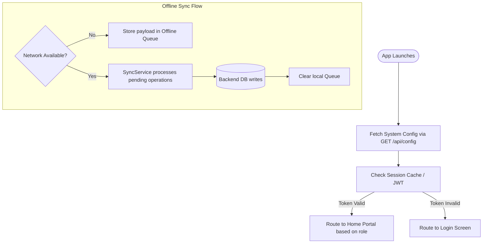
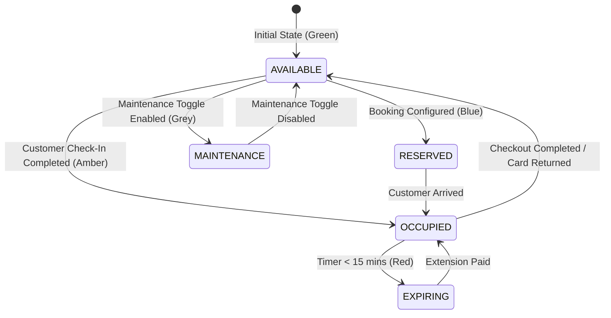
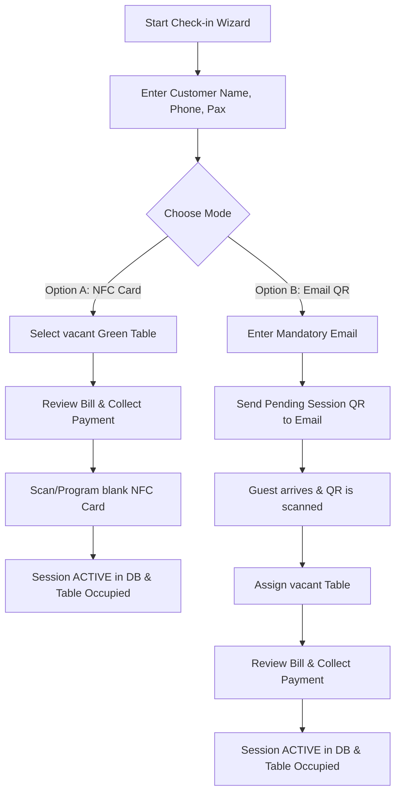
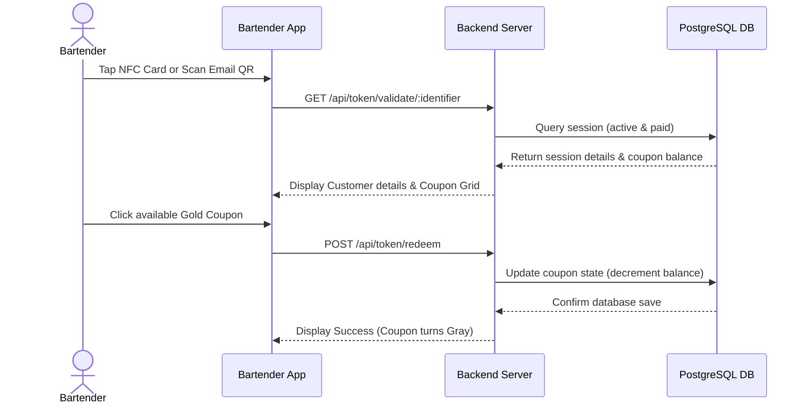
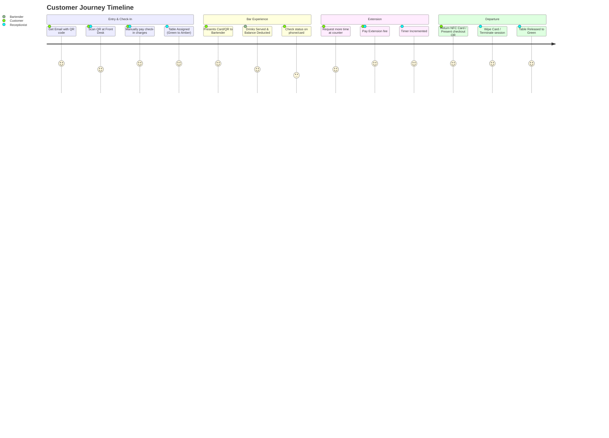
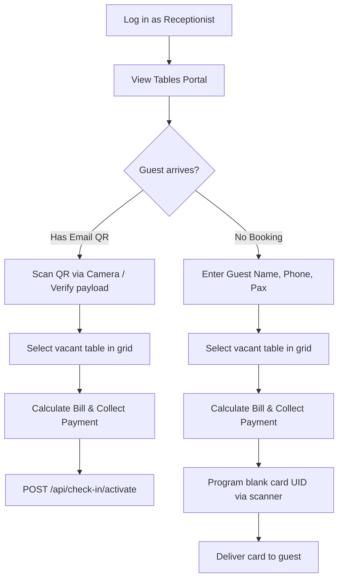
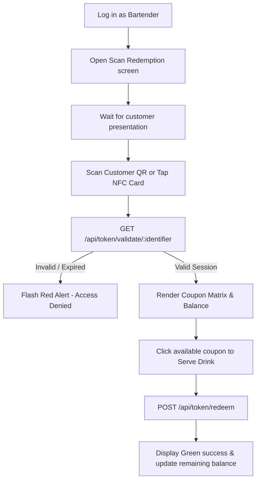
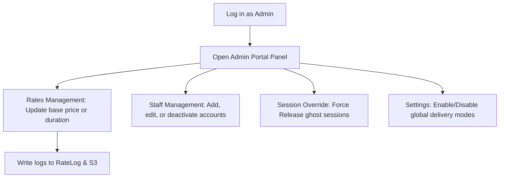

# Hybrid NFC Card & Email QR Bar Management System
## Complete End-to-End Functional Workflow Guide

This document serves as the official end-to-end functional workflow and system architecture guide for the NFC & QR Bar Management System. It is structured to help managers, QA engineers, developers, and onboarding personnel fully understand the business logic, state flows, UI pages, database transactions, API routes, and edge-case exceptions.

---

## 1. Application Navigation Hierarchy Map

Below is the complete navigation map of the system, showing access hierarchies from the initial entry point.

```
Login Screen
│
├── Dashboard (Metrics overview - Admin/Manager)
│
├── Tables Portal (Live seating map - Staff/Manager/Admin)
│   └── Seating Detail bottom sheet
│       ├── Assign Table wizard (if Available)
│       ├── Extend Time modal (if Occupied)
│       └── Close Session / Checkout modal (if Occupied)
│
├── Customer Check-in Wizard (Check-in start page - Staff/Admin)
│   ├── NFC Card mode flow
│   └── Email QR Code mode flow
│
├── Active Sessions Log list (Admin/Manager)
│
├── Bartender Portal (Drink redemption page - Bartender/Admin)
│   ├── Scanner camera overlay
│   └── Coupon grid manager
│
├── Reports & Analytics Panel (Admin/Manager)
│   ├── Sales Summary
│   ├── Hourly breakdowns SVG chart
│   └── Table utilization tables
│
└── Settings & Profile (Admin/Manager)
    └── Delivery Config toggles
```

---

## 2. Global Application Lifecycle & Sync flow

The system initializes by verifying system configurations and loading the active user session.



---

## 3. System Modules Walkthrough

---

### Module 3.1: Authentication & User Session Management

* **Purpose**: Secures the application and loads user-specific dashboards.
* **User Roles**: Admin, Staff, Manager.
* **Entry Point / Access**: App startup default view.
* **Navigation Flow**: Redirects to Dashboard or Tables map on success.
* **UI Components**: Center-aligned card, Username input box, Password input box, segmented role selector buttons, "Login" CTA button, system loading spinner.
* **Input Fields**:
  * `username` (text, mandatory)
  * `password` (text, password mask, mandatory)
  * `role` (selection: `admin`, `staff`, `manager`, mandatory)
* **Validations**: Empty fields block submission. Login is rejected if database match fails.
* **Business Rules**:
  * Staff users are routed directly to the Tables Portal.
  * Admins and Managers have dashboard and reports privileges.
* **Backend APIs involved**:
  * `POST /api/auth/login` (Request: username, password, role; Response: JWT Token, user profile metadata)
  * `POST /api/auth/logout` (Invalidates session token)
  * `GET /api/auth/me` (Validates active token expiry)
* **Database Interactions**:
  * Reads `User` table to match credentials and role assignment.
* **Success Flow**: JWT saved to AsyncStorage; user navigated to dashboard.
* **Failure Flow**: Screen flashes a red alert banner saying *"Invalid username, password, or role choice."*
* **Edge Cases**:
  * **Simultaneous Login**: The server allows multiple active sessions but invalidates stale tokens when logout is called.
  * **No internet**: The app checks local token cache and allows access only if token is still valid offline.

#### Tanglish Workflow
> App-a start panna login screen varum. Anga **username** and **password** potutu, unga job status-a (**Admin** / **Staff** / **Manager**) select pannanum. 
> Logic and details sariyaa irundha, system unga workspace dashboard-a load pannum. Details thappa irundha red warning banner varum. 

---

### Module 3.2: Tables Portal & Real-time Seating Map

* **Purpose**: Displays real-time occupancy status of all seating resources in the bar.
* **User Roles**: Admin, Staff, Manager.
* **Entry Point**: Main menu > **Tables** tab.
* **UI Components**: Area tabs, Stats overview counters, Seating Grid, status-colored table cards (Free: Green, Reserved: Blue, Occupied: Amber, Expiring: Red, Maintenance: Grey), bottom legend indicators.
* **Seating Details Slide Sheet**: Tapping a table card slides up a bottom sheet modal detailing:
  * Table ID and capacity.
  * Seating chart diagram (Circular seats are filled representing active checked-in customers, or empty outlines representing vacant slots).
  * Session elapsed timer and dynamic countdown.
  * Allowance details (drink coupons balance).
* **Actions Available**:
  * **Assign Table** (available only for Green cards): Navigates to Check-in wizard with table pre-selected.
  * **Extend Time** (available for Occupied/Expiring cards): Opens the Extension dialog.
  * **Close Session** (available for Occupied cards): Triggers return card checkout checkout modal.
  * **Manager Warning**: A read-only banner is displayed if a user is logged in as a Manager.
* **Backend APIs involved**:
  * `GET /api/tables` (Fetches table lists and active occupancies)
  * `GET /api/tables/available` (Filters vacant tables)
* **Database Interactions**:
  * Queries `Table` table and joins with active `SessionToken` records.
* **Success Flow**: Real-time polling updates color indicators and seat numbers instantly.
* **Failure Flow**: Screen displays: *"Unable to load seating map. Pull to refresh."*



#### Tanglish Workflow
> **Tables Portal** page-la bar seating map clear-ah kaatum. 
> Green-na table free-ah iruku. Amber-na customer drinks balance and timer run aagutu iruku. Red-na timer mudiyapogudhu, extend pannanum.
> Oru card click panna oru Slide Bottom sheet modal display aagum, adhula specific table-la evlo per ukandhirukanga nu blueprint chair seating plan-la round circle colors pathu check pannikalaam. Receptionist "Assign", "Extend", or "Close" options choose pannikalam.

---

### Module 3.3: Customer Registration & Check-in Wizard

* **Purpose**: Registers customer details and sets up their session delivery mode.
* **User Roles**: Staff (Receptionist) / Admin.
* **Entry Point**: Navigation menu > **Check-in** tab.
* **UI Components**: Expo Wizard pages (Step 1: Details form, Step 2: Seating selection grid, Step 3: Billing review and checkout, Step 4: Programming/Emailing).



* **Input Fields**:
  * `fullName` (text, mandatory)
  * `phone` (10-digit number, starts with 6-9, mandatory)
  * `email` (text, valid email format, optional for NFC, mandatory for Email QR)
  * `paxCount` (numerical counter, mandatory)
  * `placeType` (Standing Bar / Premium Lounge / VIP Lounge selector)
  * `deliveryMode` (NFC_CARD or EMAIL_QR selector)
* **Validations**:
  * Names cannot be blank.
  * Emails must follow `user@domain.com` standard format. No active sessions can have duplicate emails.
* **Business Rules**:
  * An Email QR Check-in starts with a status of `paymentVerified: false` and allocates a placeholder table ID (`PENDING-XXX`) in the DB.
  * Once the customer arrives, the QR code must be scanned and payment marked as collected to change status to `paymentVerified: true` and assign the actual table.
* **Backend APIs involved**:
  * `POST /api/check-in/pending` (Registers temporary QR session)
  * `POST /api/check-in/activate` (Transition to active table session on payment)
  * `POST /api/tokens/create` (Direct NFC session creation)
* **Database Interactions**:
  * Creates record in `SessionToken` and logs active table allocations.

#### Tanglish Workflow
> Receptionist counter-la customer vana udanae **Check-in wizard** step-by-step fill pannanum.
> Customer details (Name, Phone, Pax, Area) enter panni, payment vanganum.
> NFC option select panna, card scanner back-la card vechu touch panna code save aagi table green to amber state occupied aagum.
> Email option select panna, customer email mandatory-ah typ pannanum. Confirm panna pending status email QR code poirum, customer approm counter-la QR scan panni payment confirm panna table active occupied-ah maarum.

---

### Module 3.4: Bartender Portal & Beverage Redemption

* **Purpose**: Validates active guest coupons and serves drinks.
* **User Roles**: Staff (Bartender) / Admin.
* **Entry Point**: Auto-route on Bartender login.
* **UI Components**: Scan lookup page, Active Customer details card, Dynamic coupon grid matrix, redemption timeline log, "Undo" confirmation triggers.
* **Input Fields**:
  * `searchQuery` (manual lookup fallback if scanner is not used)



* **Validations & Guardrails**:
  * Tapping/scanning checks if `endTime` is in the future. Expired sessions are rejected with a red alert screen.
  * Checks if `paymentVerified` is true. Unpaid sessions cannot redeem drinks.
  * Checks if `deliveryMode` matches. If an NFC token is scanned via QR, or vice versa, the transaction is blocked.
  * If coupon count is 0, the serving button is disabled.
* **Backend APIs involved**:
  * `GET /api/token/validate/:cardUidOrToken`
  * `POST /api/token/redeem` (Redeems coupon)
  * `POST /api/token/redeem/undo` (Restores coupon balance on error)
* **Database Interactions**:
  * Updates `SessionToken` records and inserts a log in the `Redemptions` table.

#### Tanglish Workflow
> Bartender drink serve panna, first card-a pathu scanner-la scan or scan QR code pannanum.
> Details active-ah correct-ah irundha, customer coupons list (Gold color boxes) kaatum.
> Drink serve panna, oru gold box click pannanum, box color change aayidum (Grey tick). Balance count database-la korayum. Thappa tap pannitta, undo button thottu reset pannikalaam.

---

### Module 3.5: Customer Checkout & Session Closure

* **Purpose**: Finalizes billing and releases resources (wipes physical cards).
* **User Roles**: Staff / Admin.
* **Entry Point**: Seating Bottom sheet > **Close Session** or Active Sessions list.
* **UI Components**: Return Card Modal, checkout pricing summaries, cash/card payment toggles, NFC scanner loader, final success tick mark.
* **Validations**:
  * Ensures physical card is cleared (returns success code from scanner write action) before table status changes to `AVAILABLE` in the database.
* **Backend APIs involved**:
  * `PUT /api/tokens/:tokenNumber/close` (Concludes session)
* **Database Interactions**:
  * Updates `SessionToken` status to `'CLOSED'`.
  * Sets associated `Table` status to `'AVAILABLE'`.
  * Sets associated `Card` status to `'AVAILABLE'`.

#### Tanglish Workflow
> Customer check-out panna, customer card scanner counter-la vanganum.
> **Close Session** modal-la bill settlement screen varum. payment confirm pannittu **Confirm & Close Session** tap pannanum.
> NFC card memory clear aagum, table and card dynamic status direct-ah green free state-ku register aagidum.

---

### Module 3.6: Session Extension

* **Purpose**: Extends active session duration without issuing new cards or QR codes.
* **User Roles**: Staff / Admin.
* **Entry Point**: Bottom sheet > **Extend Time** or Active Sessions list.
* **UI Components**: Extension Modal, time-slot radio buttons, fee calculation summary table, UPI/Cash payment mode selector tabs, dummy QR code wrapper.
* **Input Fields**:
  * `duration` (30 mins, 1 hour, 2 hours selectors)
  * `paymentMethod` (UPI / Cash toggles)
* **Business Rules**:
  * Extensions are appended to the existing session `endTime`. No new token is created.
  * Extends the session in database immediately upon payment verification.
* **Backend APIs involved**:
  * `PUT /api/tokens/:tokenNumber/extend`
* **Database Interactions**:
  * Updates the `SessionToken` table to increment `endTime`.
  * Records details in `ExtensionLog` table.

#### Tanglish Workflow
> Customer extra time bar-la iruka keta, time duration extend pannalam.
> **Extend Time** modal open panni evlo time venum nu duration select pannanum (30 mins / 1 hr / 2 hrs).
> Payment detail select panna dynamic UPI QR display aagum. Cash or UPI confirmation click panna udanae existing card timer extension time aayidum. Pudhu card or QR thevaiyillai.

---

### Module 3.7: Admin Settings & Rate Management

* **Purpose**: Configures pricing, table resources, staff accounts, and global delivery modes.
* **User Roles**: Admin only.
* **Entry Point**: Navigation menu > **Admin Portal**.
* **UI Components**: Tab panels (Rates list, Staff Registry, Table Config, System settings).
* **Input Fields**:
  * `ratePerPerson` (currency, decimal)
  * `baseDuration` (minutes)
  * `maxDrinks` (number)
* **Validations**: Values must be numeric and positive.
* **Backend APIs involved**:
  * `PUT /api/rate-cards/:id` (Updates rate card settings)
  * `PUT /api/config/delivery-methods` (Updates global configuration settings)
* **Database Interactions**:
  * Updates `PlaceTypeConfig` and `SystemConfig` tables.

#### Tanglish Workflow
> **Admin Portal** sub-tabs-la rates and global system settings select pannalam.
> Lounge or Standing bar price update panna, rate edit panni save pannanum.
> Delivery setting-la (NFC card or Email QR) toggles check or uncheck panni global configuration restrict or open pannalaam. New check-ins-ku update automatic-ah apply aagum.

---

### Module 3.8: Reports, Charts, & Analytics

* **Purpose**: Provides financial metrics and hourly utilization tracking.
* **User Roles**: Admin / Manager.
* **Entry Point**: Admin Portal > **Reports** sub-tab.
* **UI Components**: Date range calendars, SVG hourly line/bar utilization chart, spreadsheet table detailing utilization percentages.
* **Backend APIs involved**:
  * `GET /api/reports/dashboard`
  * `GET /api/reports/hourly-breakdown`
  * `GET /api/reports/table-utilization`
* **Database Interactions**:
  * Joins and aggregations on `SessionToken`, `Redemptions`, `ExtensionLog` tables.

#### Tanglish Workflow
> Analytics reports pathu bar usage evaluate pannalaam.
> Dynamic date range fields enter panni custom reports choose pannalam.
> SVG hourly chart-la peak business timings and table utilization levels percentage details clear table formats-la check pannalaam.

---

## 4. Business Rules Matrix

| Rule Domain | Business Constraint | Database Implementation |
| :--- | :--- | :--- |
| **Table Occupancy** | A table cannot be assigned to more than one active session. | Unique constraint on `tableId` where `SessionToken.status == 'ACTIVE'` |
| **NFC Card Binding** | A physical card UID cannot be linked to more than one active session. | Unique constraint on `cardUid` where `SessionToken.status == 'ACTIVE'` |
| **Email QR Mode** | Email field is mandatory and must not already have an active check-in. | Email validation regex check; query `SessionToken` for active status prior to pending registration. |
| **Session Expiration** | Session transition from occupied (amber) to expiring (red) at 15 minutes remaining. | React frontend timer ticks; server rejects redemptions if check timestamp > `endTime`. |
| **Manager Permission** | Managers can view all tables, sessions, and reports, but cannot perform check-ins/checkout. | API middleware checks JWT payload claims and blocks POST/PUT operations. |

---

## 5. Security & Verification Features

* **JWT Middleware Validation**: Every outgoing API request is signed with a bearer token. The backend verifies signature integrity and user roles prior to execution.
* **Signature QR Validation**: Emailed QR codes contain a signed cryptography payload. This protects the bar against forged or screenshot-shared codes.
* **Audited Rate Changes**: Whenever an admin alters rate cards or pricing metrics, a record is created in the `RateLog` table, and logs are backed up to S3 bucket storage automatically.

---

## 6. Comprehensive Navigation Map & Journeys

### Navigation Map Hierarchy
```
Login Screen
│
├── Dashboard (Manager/Admin Only)
│
├── Tables Portal (Staff/Manager/Admin)
│   └── Seating Detail Bottom Sheet
│       ├── Assign Seating (Receptionist Check-In Wizard)
│       ├── Extend Time (Payment/UPI Modal)
│       └── Close Session (Return Card Modal)
│
├── Bartender Portal (Bartender Only)
│   └── Scan Card/QR -> Serves Drink -> Updates DB
│
└── Admin Settings Dashboard (Admin Only)
    ├── Manage Users
    ├── Edit Seating Rates
    └── Manage Tables Configuration
```

---

### End-to-End Customer Journey



---

### End-to-End Staff (Receptionist) Journey



---

### End-to-End Bartender Journey



---

### End-to-End Admin Journey



---

## 7. Common FAQs & Troubleshooting Guide

### Q1: The physical card scanner says "Write failed" or "NFC not supported".
* **Solution**: Ensure your mobile/tablet has NFC enabled in system settings. Keep the physical card touching the back of the device until the success tick mark animation is fully displayed.

### Q2: What is a "Ghost Session" and how do I fix it?
* **Solution**: A Ghost Session happens when a customer session is active in the database but the card was lost, damaged, or not cleared at checkout. An Admin can go to the **Customer Sessions** sub-tab in the Admin Portal, find the session, click "End Session", and select the **Force Release (Ghost/Orphan Override)** option. This forces the table and card to return to `'AVAILABLE'` status directly.

### Q3: How do we sync data registered while the internet was offline?
* **Solution**: You don't need to do anything manually. The app has an offline queue sync engine. Transactions made offline are stored locally in the queue. As soon as a stable internet connection is established, the background service syncs the data to the PostgreSQL database automatically.

---

## 8. Glossary of Business Terms

* **NFC Card Mode**: Standalone delivery method where customer session data is programmed onto a physical high-frequency smart card.
* **Email QR Mode**: Delivery method where a secure signed QR code is emailed to the customer, which they present at check-in, checkout, and the bar.
* **EAS Update**: Expo Application Services OTA update system, used to deliver code changes (styling, UI layouts) directly to installed apps over the internet.
* **Pax**: The number of persons in a customer group session.
* **Ghost Session Override**: Admin permission to force release locked tables and cards without validating the physical NDEF sector records.
* **Rate Card**: Pricing configuration model that defines costs, allowances, and times per specific seating areas.

---

## 9. Android Hardware Back Button Navigation Stack

The application enforces a custom state-based prioritized back button navigation stack on Android devices to ensure consistent back gestures and prevent data loss:

```
[Back Press Event]
       │
       ▼
┌─────────────────────────────┐
│ 1. Critical Operation?      │──► YES ──► [Block & Ignore Back Press]
└─────────────────────────────┘
       │ NO
       ▼
┌─────────────────────────────┐
│ 2. Modals/Overlays Open?    │──► YES ──► [Check Dirty State?] ──► [Dismiss Overlay]
└─────────────────────────────┘
       │ NO
       ▼
┌─────────────────────────────┐
│ 3. Wizard Step > 1?         │──► YES ──► [Navigate back to previous step]
└─────────────────────────────┘
       │ NO
       ▼
┌─────────────────────────────┐
│ 4. Non-Default Role Tab?    │──► YES ──► [Redirect to Role-Aware Home Tab]
└─────────────────────────────┘
       │ NO
       ▼
┌─────────────────────────────┐
│ 5. Root / Login Screen?     │──► YES ──► [Double-Tap toast to exit app]
└─────────────────────────────┘
```

### Key Constraints & Rules
1. **Critical Operation Protection**: Ignored during active NFC Card programming (`isNfcWriting`), payment processing, or checkout database commits to prevent transaction corruption.
2. **Unsaved Form Protection**: Step 1 forms (Check-in details) and Admin form overlays (Add Table, Add Staff, Edit Rates) perform a dirty check. If modifications are present, prompts a confirmation Alert asking to discard or continue editing.
3. **Throttling Lock**: Ignores rapid multiple back presses within 350ms to ensure transitions and layout animations complete before processing the next event.
4. **Role-Aware Home Tab**: Navigates back to the default tab dynamically based on the authenticated user's role:
   - Receptionist/Admin: `'checkin'` tab
   - Bartender: `'bartender'` tab
   - Manager: `'tables'` tab
5. **Double-Back Exit**: Prompts the user with a `"Press back again to exit"` toast on the root screens. Exits only if pressed twice within 2000ms.